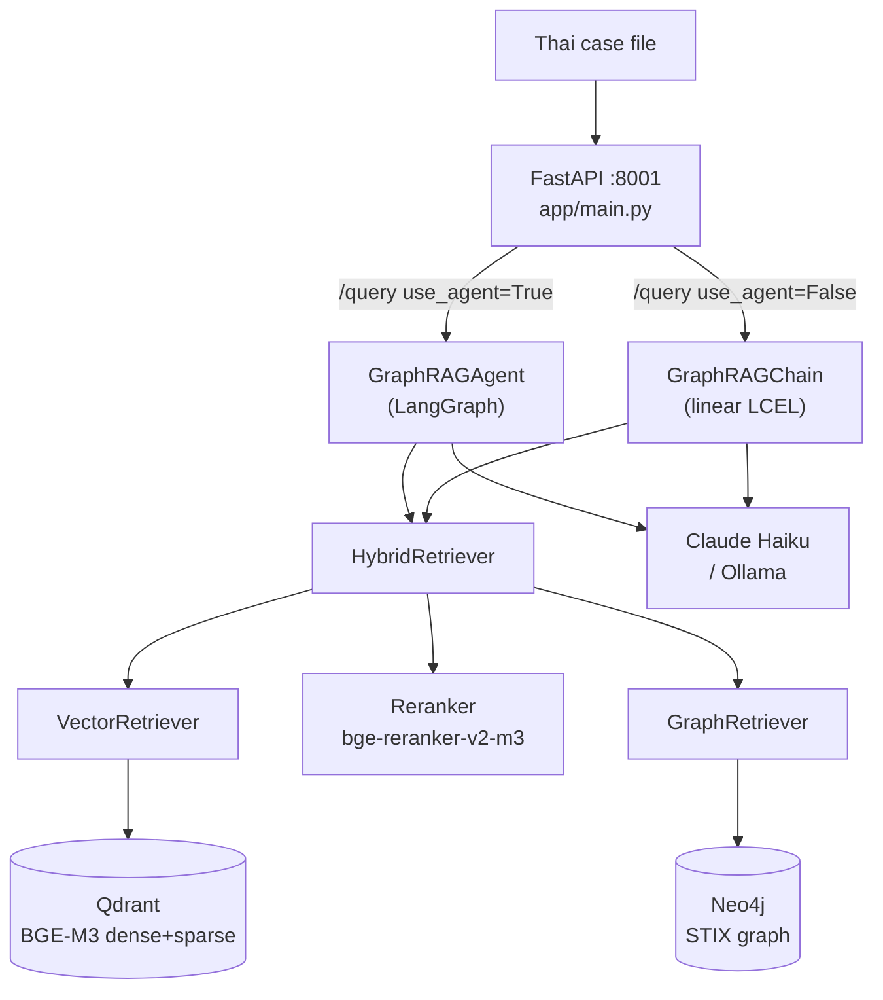
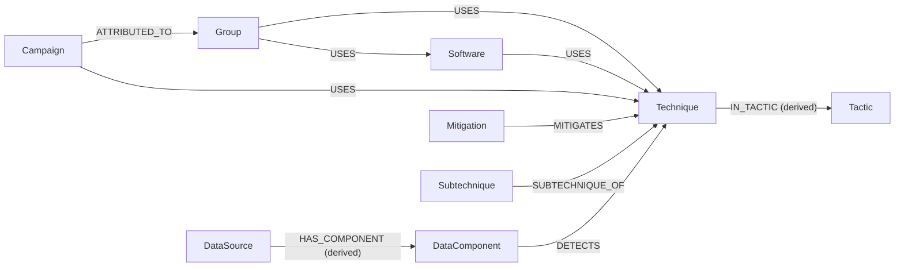
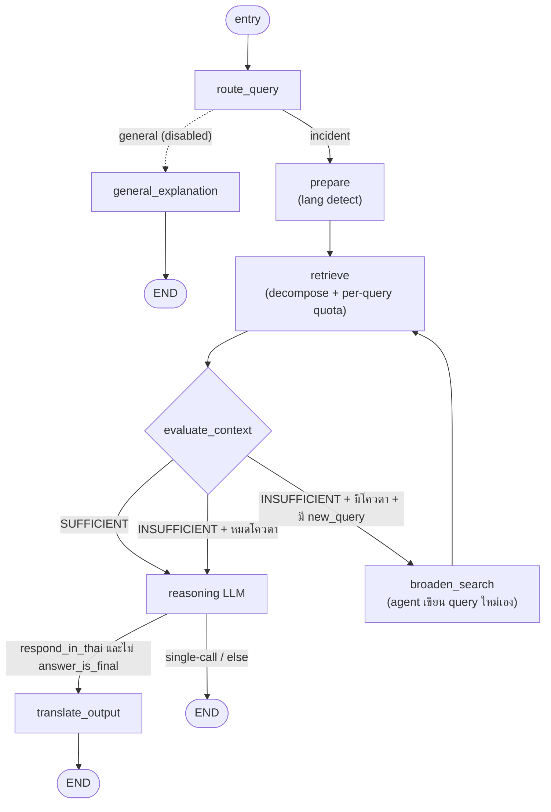

# CyberCase RAG Service — สถาปัตยกรรม & คู่มืออ้างอิงโค้ดทุกฟังก์ชัน

> ⚠️ **ล้าสมัยบางส่วน — ตรวจเมื่อ 2026-08-15 (branch `chore/rag-service-cleanup`)**
> เอกสารนี้ยังไม่ได้อัปเดตตามการลบ dead code รอบล่าสุด จุดที่ไม่ตรงกับโค้ดแล้ว:
> `use_local`/Ollama ถูกถอดออกจาก pipeline ที่ให้บริการ (เหลือใช้เฉพาะ `evaluation/`) ·
> `GraphRAGChain` ไม่ได้อยู่บนเส้นทาง production อีกต่อไป — `POST /query` เข้า `GraphRAGAgent` เสมอ
> และ CLI ก็เป็น agent-only แล้ว · agent ไม่แปล query เป็นอังกฤษก่อน retrieve ·
> `USE_LOCAL`, `CHROMA_*`, `GRAPH_EXPANSION_DEPTH`, `THANOY_*` ถูกลบออกจาก `config.py`
> ให้ยึด `CLAUDE.md` และตัวโค้ดเป็นหลัก (ไฟล์ `.pdf` คู่กันก็เก่าตามไปด้วย)

> เอกสารนี้เขียนขึ้นใหม่ทั้งหมดจากการอ่านซอร์สโค้ด `rag_service/` ทุกไฟล์ (ไม่อ้างอิงเอกสารเดิม)
> ครอบคลุม: ภาพรวมสถาปัตยกรรม, เทคนิค/method, DB schema, โมเดลทุกตัวใน pipeline,
> และคำอธิบาย **ทุกฟังก์ชัน/คลาส** แยกตามไฟล์
>
> ขอบเขต: `rag_service/app/RAG/GraphRAG` (pipeline RAG หลัก), `rag_service/app` (FastAPI + CLI + utilities),
> `rag_service/docs`, และ `rag_service/finetune` (โมดูล fine-tune MITRE specialist)
>
> 📘 **เพิ่งเข้าโปรเจกต์?** อ่าน [docs/PRIMER.md](docs/PRIMER.md) ก่อน — ปูพื้น MITRE ATT&CK / RAG / GraphRAG / Agentic / ศัพท์เฉพาะ ที่ต้องรู้ก่อนเอกสารนี้

---

## สารบัญ

1. [ภาพรวมสถาปัตยกรรม](#1-ภาพรวมสถาปัตยกรรม)
2. [เทคนิค/Method ที่ใช้](#2-เทคนิคmethod-ที่ใช้)
3. [โมเดลทุกตัวใน Pipeline](#3-โมเดลทุกตัวใน-pipeline)
4. [DB Schema (Neo4j + Qdrant)](#4-db-schema)
5. [โครงสร้างไดเรกทอรี](#5-โครงสร้างไดเรกทอรี)
6. [Request Lifecycle](#6-request-lifecycle)
7. [อ้างอิงโค้ดทุกฟังก์ชัน](#7-อ้างอิงโค้ดทุกฟังก์ชัน)
   - [7.1 app/main.py](#71-appmainpy--fastapi-service)
   - [7.2 config.py](#72-configpy)
   - [7.3 models.py](#73-modelspy)
   - [7.4 pipeline/](#74-pipeline)
   - [7.5 retrieval/](#75-retrieval)
   - [7.6 ingestion/](#76-ingestion)
   - [7.7 evaluation/](#77-evaluation)
   - [7.8 CLI & utilities](#78-cli--utilities)
   - [7.9 finetune/](#79-finetune)

---

## 0. อัปเดตล่าสุด (2026-07 — Changelog)

การเปลี่ยนแปลงสำคัญที่ทำหลังเอกสารรุ่นก่อน (สะท้อนใน main แล้ว):

| การเปลี่ยนแปลง | ไฟล์ | สาระ |
|---|---|---|
| **Single-call generation (variant C)** | `agent_graph._node_reasoning`, `cross_lingual.get_fast_system_prompt`, `config.SINGLE_CALL_GENERATION` | สำหรับ query ไทย: reason บน context อังกฤษ + เขียนคำตอบไทยใน **call เดียว** (ตั้ง `answer_is_final=True` → ข้าม `translate_output`) แทน two-stage reason→translate เดิม พิสูจน์ด้วย benchmark ว่าคุณภาพเท่ากันแต่ latency/ต้นทุนครึ่งเดียว ตั้ง `SINGLE_CALL_GENERATION=false` เพื่อกลับ two-stage |
| **🔥 ถอด Follow-up module ออกทั้งหมด** | `agent_graph`, `evaluator`, `routers/rag.py`, ลบ `query_merger.py` | ความสามารถถาม-ตอบย้อนกลับ (pause → ถาม → `resume`) **ถูกย้ายไปเป็นหน้าที่ของ Backend** แล้ว: ลบ `POST /resume`, `GraphRAGAgent.resume()`, session store, slot machinery (`incident_facts`/`asked_slots`/`missing_slot`) — pipeline วิ่งจบรอบเดียวเสมอ (`status` = `completed` ตลอด) INSUFFICIENT ตอนนี้ไปทาง **BROADEN_SEARCH** (agent เขียน query ใหม่เองแล้ววน retrieve, เพดาน 2 รอบ) แทนการถามผู้ใช้ ดูรายละเอียด: `docs/FOLLOWUP_REMOVAL.md` |
| **Batched Neo4j expansion** | `graph_retriever.expand_batch` | `expand()` เดิมวน `_expand_single` ทีละ seed (3N round-trip) → รวมเป็น 3 Cypher UNWIND ต่อ seed list (เร็ว 3.5× ที่ชั้น expand, ผลเหมือนเดิม) |
| **Device-aware model loading** | `config.DEVICE`, `config.USE_FP16`, `reranker` | auto GPU/CPU; `USE_FP16 = (DEVICE=="cuda")` — fp16 เฉพาะ GPU (prod Railway = CPU → fp32); override ด้วย `RAG_DEVICE=cpu\|cuda` |

รายงานประกอบ: `docs/retrieval_perf_optimization.md`, `evaluation/results/`

---

## 1. ภาพรวมสถาปัตยกรรม

`rag_service` เป็น **FastAPI microservice (พอร์ต 8001)** ที่โฮสต์ GraphRAG pipeline ทั้งหมด
Backend gateway (พอร์ต 8000) เป็นเพียง proxy ที่เรียกบริการนี้ผ่าน HTTP ส่วน RAG ทั้งหมดอยู่ที่นี่

```
                       ┌──────────────────────────────────────────────┐
   Thai case file ───▶ │  FastAPI (app/main.py, :8001)                 │
                       │  /query  /health  /retrieval-contexts/{id}     │
                       └───────────────┬──────────────────────────────┘
                                       │ (โหลดโมเดล + เชื่อม DB ครั้งเดียวตอน startup)
          ┌────────────────────────────┼─────────────────────────────────┐
          ▼                            ▼
   GraphRAGAgent              HybridRetriever
   (LangGraph state machine)  ├─ VectorRetriever ─▶ Qdrant (BGE-M3 dense+sparse)
   route→prepare→retrieve     ├─ Reranker (bge-reranker-v2-m3)
   →evaluate→(broaden|         └─ GraphRetriever ─▶ Neo4j (STIX graph, 1-hop expand)
     reason)
   →translate→END
```



**2 เส้นทางหลักของบริการ**

| Endpoint | คลาสที่ใช้ | เส้นทาง |
|---|---|---|
| `POST /query` (`use_agent=True`) | `GraphRAGAgent` | agentic LangGraph: decompose → quota-retrieve → evaluate → (broaden loop) → **generate** (default: single-call ไทย; fallback: reason→translate) |
| `POST /query` (`use_agent=False`) | `GraphRAGChain` | linear LCEL: translate → dual-query retrieve → reason → translate |

**หมายเหตุ**:
- Endpoint การสร้างรายงาน (`/generate-report`) และองค์ประกอบรายงานถูกย้ายไปที่ Backend Service (Phase 2A refactor)
- `POST /resume` (follow-up) **ถูกลบแล้ว** — การถาม-ตอบย้อนกลับเป็นหน้าที่ของ Backend (ดู §0 changelog + `docs/FOLLOWUP_REMOVAL.md`) บริการนี้ตอบครบจบในรอบเดียวเสมอ

**สอง pipeline ที่ขนานกันในโค้ด**
- `GraphRAGAgent` (`pipeline/agent_graph.py`) — เส้นทาง production agentic ใหม่ (decomposer + quota + self-reflection)
- `GraphRAGChain` (`pipeline/chain.py`) — เส้นทาง linear เดิม (ยังใช้ใน eval generation)

---

## 2. เทคนิค/Method ที่ใช้

| เทคนิค | ที่อยู่ | สาระสำคัญ |
|---|---|---|
| **GraphRAG** | `retrieval/hybrid_retriever.py` | รวม Vector search + Graph expansion: ดึง top-K จาก Qdrant แล้วขยาย subgraph จาก Neo4j ตาม stix_id |
| **Hybrid Vector Search (Dense + Sparse)** | `vector_retriever.py` | BGE-M3 ให้ทั้ง dense (1024-d) และ sparse (lexical) → Qdrant native RRF fusion ในเครื่อง query เดียว |
| **RRF (Reciprocal Rank Fusion)** | Qdrant `FusionQuery(Fusion.RRF)` + config `RRF_K=60` | รวมผล dense/sparse และผลข้าม collection |
| **Cross-encoder Reranking** | `retrieval/reranker.py` | `bge-reranker-v2-m3` ให้คะแนน (query, doc) ใหม่ → sigmoid → top-K ก่อนป้อน graph + LLM |
| **Node-type re-weighting** | `hybrid_retriever._reweight_by_type` | คูณคะแนน Technique/Subtechnique/Tactic ขึ้น, Group/Software/Campaign ลง → technique ลอยขึ้น |
| **Cross-lingual retrieval** | `pipeline/cross_lingual.py` | input ไทยเสมอ, output ไทยเสมอ; แปลอังกฤษเป็น internal-only |
| **Dual-query (chain/report path)** | `build_retrieval_queries` | ดึงทั้ง query อังกฤษที่แปล + query ไทยต้นฉบับขนานกัน กัน mistranslation ทำ retrieval พัง |
| **Query Decomposition (agent path)** | `pipeline/query_decomposer.py` | แตก incident เป็น sub-query atomic ต่อ technique (ภาษาเดิม, ไม่แปล — BGE-M3 multilingual) |
| **Per-query Quota Retrieval** | `hybrid_retriever.retrieve_multi_quota` | เก็บ top-`per_query_k` ของแต่ละ sub-query แล้ว round-robin interleave → ทุก technique ได้พื้นที่ |
| **Self-reflection / Self-RAG loop** | `pipeline/evaluator.py` + agent edges | LLM ประเมิน context พอหรือไม่ → SUFFICIENT / INSUFFICIENT → **BROADEN_SEARCH** (agent เขียน query ใหม่เอง แล้ววน retrieve ซ้ำ เพดาน `MAX_BROADEN_RETRIES=2`); ไม่มีการหยุดถามผู้ใช้แล้ว |
| **Retrieval query sanitizer** | `pipeline/query_sanitizer.py` | ตัด markdown + ATT&CK ID token ออกจาก query ที่ LLM เขียน (BROADEN_SEARCH) ก่อนเข้า embedding — กันไปแมตช์ metadata แทน description |
| **Cross-lingual generation** | `cross_lingual` prompts, `agent_graph._node_reasoning` | **Default (agent, variant C):** call เดียว — reason บน EN context + เขียนไทยเลย (`get_fast_system_prompt`, `answer_is_final=True`). **Fallback (`SINGLE_CALL_GENERATION=false` / chain path):** two-stage — reasoning LLM → EN แล้ว translation LLM → Thai. หมายเหตุ: agent path ไม่แปล query ขาเข้า (ไทยเข้า retrieval ตรงๆ) |
| **Faithful MITRE table** | `Backend ReportGenerator` | สร้างตารางจาก entity ที่ retrieve จริง (ไม่ใช่จาก LLM) → ID ไม่ถูก hallucinate |
| **CJK Thai-only guard** | `Backend ReportGenerator` | ตรวจ token จีน/ญี่ปุ่น/เกาหลีหลุดในรายงาน → re-translate field เป็นไทยล้วน |
| **Domain filter (mobile กันปน)** | `vector_retriever.search_entities` + `config.ATTACK_DOMAIN_FILTER` | กรอง entity ให้เหลือ domain enterprise หลัง retrieval |
| **Agentic state machine** | `pipeline/agent_graph.py` (LangGraph) | StateGraph: node + conditional edges; stateless — ไม่มี session store แล้ว (graph วิ่งจบในการเรียกครั้งเดียว) |
| **Thai legal delegation** | `pipeline/thanoy_client.py` | ไม่สอนกฎหมายไทยให้ MITRE model (กัน hallucinate มาตรา) → เรียก Thanoy API แทน |
| **Eval: retriever metrics** | `evaluation/retriever_metrics.py` | Hit@K, capped Recall@K, Precision@K, MRR, NDCG@K, MAP, **step-coverage@k (named/described)** |
| **Eval: generation metrics** | `evaluation/generation_metrics.py`, **`attack_id_metrics.py`** | RAGAS + fallback Token-F1/ROUGE-L/BERTScore; **technique ID-F1 (partial credit), tactic F1, thai-ratio, structure, id_survival** |
| **Eval: 5-variant crosslingual harness** | `evaluation/crosslingual_generation_benchmark.py` | เทียบ generation variant บน frozen context; 3-layer (retrieval/mapping/generation) บน gold เดียวกัน + paired stats |
| **Graph-grounded eval dataset** | `evaluation/generate_eval_dataset.py`, **`make_incident_dataset.py`** | ground-truth จาก Cypher (กราฟ = ground truth); incident สำนวนคดีไทยเรียงเวลา (kill-chain + named/described cue) |
| **MITRE specialist fine-tune** | `finetune/` | QLoRA/16-bit LoRA บน Qwen, dataset จาก STIX, A/B เทียบ base vs fine-tune ผ่าน env-swap |

---

## 3. โมเดลทุกตัวใน Pipeline

| บทบาท | โมเดล (cloud) | โมเดล (local `--local`) | ตั้งค่าที่ |
|---|---|---|---|
| **Embedding** | `BAAI/bge-m3` (1024-d, FP16, dense+sparse) | (เหมือนกัน) | `EMBED_MODEL`, `USE_FP16` |
| **Reranker** | `BAAI/bge-reranker-v2-m3` (cross-encoder, รองรับไทย) | (เหมือนกัน) | `RERANKER_MODEL` |
| **Reasoning / Translation / Router / Decomposer LLM** | `claude-haiku-4-5` | `qwen2.5:7b` (Ollama) | `LLM_MODEL` / `LOCAL_LLM_MODEL` |
| **Evaluator LLM** | `claude-haiku-4-5` | `gemma3:4b` (Ollama) | `EVALUATOR_LLM_MODEL` / `LOCAL_EVAL_MODEL` |
| **RAGAS judge (eval)** | Claude Haiku → OpenRouter `qwen/qwen-2.5-72b-instruct` | `gemma3:4b` | `RAGAS_LLM_MODEL`, `OPENROUTER_*` |
| **RAGAS embeddings (eval)** | `nomic-embed-text` (Ollama, local) | (เหมือนกัน) | hard-coded ใน `generation_metrics` |
| **Thai legal AI** | Thanoy (iApp REST API) | (เหมือนกัน) | `THANOY_API_*` |
| **Fine-tune target** | — | `Qwen/Qwen3.5-4B` → `mitre-qwen3.5:4b` (16-bit LoRA) | `finetune/ft_config.py` |

> หมายเหตุ: master switch `USE_LOCAL` (env) สลับทั้ง pipeline ไป Ollama; CLI ใช้ flag `--local` (eval/finetune)
> `download_model.py` (ใช้ตอน build Docker) ยัง pre-cache reranker ตัวเก่า `cross-encoder/mmarco-mMiniLMv2-L12-H384-v1`

**Tech stack** (จาก `requirements.txt`): FastAPI + Uvicorn, Pydantic v2, `neo4j`, `qdrant-client`, `FlagEmbedding` (BGE-M3), `sentence-transformers` (reranker), LangChain (`langchain-anthropic`, `langchain-ollama`, `langgraph`), `anthropic`, `httpx`, `stix2`, RAGAS/datasets/bert-score/rouge-score (eval), torch/transformers.
**Deploy**: `Dockerfile` (python:3.11-slim) ติดตั้ง torch CPU, pre-cache embedding model, รัน `uvicorn app.main:app --port 8001`. Neo4j + Qdrant เป็น cloud-hosted

---

## 4. DB Schema

### 4.1 Neo4j (Graph DB) — STIX entities + relationships

**Node labels** (ทุก node ได้ base label `:Entity` เพิ่มด้วย เพื่อ match เร็วตอนสร้าง edge):

`Technique`, `Subtechnique`, `Group`, `Software`, `Campaign`, `Mitigation`, `Tactic`, `DataSource`, `DataComponent`

**Node properties** (จาก `graph_loader._entity_to_props`):
- ทุก node: `stix_id` (unique), `attack_id`, `name`, `description` (≤5000 ตัวอักษร), `url`, `domain` (`enterprise`/`mobile`/`ics`)
- `Technique`/`Subtechnique`: `platforms`, `is_subtechnique`
- `Software`: `software_type` (`tool`/`malware`), `aliases`
- `Tactic`: `shortname` (เช่น `initial-access`)
- `Group`/`Campaign`: `aliases`

**Edge types** (จาก `RELATIONSHIP_TYPE_MAP` + derived edges):

| Edge | จาก → ไป | ที่มา |
|---|---|---|
| `USES` | Group/Software/Campaign → Technique/Software | STIX `uses` |
| `MITIGATES` | Mitigation → Technique | STIX `mitigates` |
| `SUBTECHNIQUE_OF` | Subtechnique → Technique | STIX `subtechnique-of` |
| `ATTRIBUTED_TO` | Campaign → Group | STIX `attributed-to` |
| `DETECTS` | DataComponent → Technique | STIX `detects` |
| `IN_TACTIC` | Technique → Tactic | **derived** จาก `kill_chain_phases` |
| `HAS_COMPONENT` | DataSource → DataComponent | **derived** จาก `x_mitre_data_source_ref` |
| (ข้าม `REVOKED_BY`) | — | กรองทิ้ง |

Edge property: `stix_id`, `description` (≤5000)



**Constraints**: `stix_id IS UNIQUE` ทุก label + `:Entity`
**Indexes**: `Technique/Subtechnique.attack_id`, `Group/Software.name`, `Tactic.shortname`

### 4.2 Qdrant (Vector DB) — BGE-M3 embeddings

2 collections:
- **`mitre_entities`** (~2,733 docs): ข้อความ embed = `"{node_label}: {name}. {description}"`
- **`mitre_relationships`** (~25,467 docs): ข้อความ embed = `"{source_name} {edge_label} {target_name}: {description}"`

**Vector config** (ต่อ point): `dense` (size 1024, Cosine) + `sparse` (SparseVector)
**Point ID**: UUID ที่ derive จาก stix_id (`uuid_from_stix_id`)

**Payload schema**:
- entities: `stix_id`, `attack_id`, `entity_type="Node"`, `node_label`, `name`, `domain`, `url`, `document`
- relationships: `stix_id`, `entity_type="Relationship"`, `edge_label`, `source_id`, `target_id`, `source_name`, `target_name`, `document`

> ⚠️ payload `domain` มีเฉพาะ collection entities (relationships ไม่มี) — domain filter จึงทำได้กับ entity เท่านั้น
> ⚠️ การ filter `domain` ฝั่ง Qdrant ต้องมี payload index (cloud ปัจจุบันไม่มี) → โค้ดจึง over-fetch แล้วกรองใน Python

---

## 5. โครงสร้างไดเรกทอรี

```
rag_service/
├── Dockerfile                       # python:3.11-slim, pre-cache embed model, uvicorn :8001
├── requirements.txt
├── app/
│   ├── main.py                      # FastAPI service (3 endpoints + lifespan)
│   ├── download_model.py            # pre-cache โมเดลตอน Docker build
│   ├── _perf_probe.py               # เครื่องมือวัดเวลาแต่ละ node (throwaway)
│   └── RAG/
│       ├── __init__.py              # re-export public API
│       └── GraphRAG/
│           ├── config.py            # ค่าคอนฟิกทั้งหมด + sep()
│           ├── models.py            # Pydantic models ของ STIX entities/relationships
│           ├── main.py              # CLI (--ingest/--test/--agent/--retrieve-only)
│           ├── pipeline/            # agent_graph, chain, router, cross_lingual,
│           │                        #   query_decomposer, evaluator, query_sanitizer,
│           │                        #   context_builder, mitre_table, thanoy_client
│           ├── retrieval/           # vector_retriever, graph_retriever, reranker, hybrid_retriever
│           ├── ingestion/           # stix_parser, graph_loader, vector_loader
│           └── evaluation/          # ground_truth, retriever_metrics (step-coverage),
│                                    #   generation_metrics, attack_id_metrics,
│                                    #   crosslingual_generation_benchmark (5-variant harness),
│                                    #   make_incident_dataset, generate_eval_dataset,
│                                    #   build_deprecated_blocklist, export_alias_tables,
│                                    #   eval_runner, crosslingual_benchmark, test_metrics
│                                    #   data/ (contexts cache, incident_draft, attack_lookup)
│                                    #   results/ (benchmark reports + PDFs)
├── docs/
│   ├── _build_pdf.py                # render RAG_Module.md → HTML (mermaid) → PDF
│   └── FOLLOWUP_REMOVAL.md          # รายงานการถอด Follow-up module (2026-07-28)
└── finetune/                        # MITRE specialist fine-tune (QLoRA/LoRA)
    ├── ft_config.py
    ├── data/templates.py            # STIX → (Q,A) templates
    ├── data/build_dataset.py        # STIX → SFT jsonl (closed-book + grounded + abstention)
    ├── train/train_unsloth.py       # LoRA trainer (Unsloth)
    ├── compare/run_comparison.py    # A/B base vs fine-tune (env-swap)
    └── export/merge_and_gguf.py     # merge LoRA → GGUF (llama.cpp)
```

---

## 6. Request Lifecycle

### 6.1 Startup (`lifespan`)
โหลด BGE-M3 ครั้งเดียว → สร้าง `GraphRAGChain`, `GraphRAGAgent`, `HybridRetriever`, `ReportGenerator` (แชร์ embed model) → เชื่อม Neo4j/Qdrant → เก็บไว้ใน `app.state`. ถ้าพังจะ set เป็น `None` (endpoint คืน 503)

### 6.2 `POST /query` (agent)
`route_query` → `prepare` (ตรวจภาษา) → `retrieve` (decompose → `retrieve_multi_quota` → `build_context`) → `evaluate_context` →
- **SUFFICIENT** → `reasoning` → END (single-call เขียนไทยเลย) / หรือ → `translate_output` → END (two-stage เมื่อ `SINGLE_CALL_GENERATION=false`)
- **INSUFFICIENT** + ยังมีโควตา (`broaden_count < MAX_BROADEN_RETRIES=2`) + evaluator ให้ `new_query` ที่ใช้ได้ → `broaden_search` → วน `retrieve`
- **INSUFFICIENT** แต่หมดโควตา / ไม่มี rewrite ที่ใช้ได้ → `reasoning` (ตอบด้วย context เท่าที่มี; ถ้า strategy = `ACKNOWLEDGE_LIMIT` จะคืนข้อความบอกข้อจำกัดแทน)



> **single-call (default):** node `reasoning` เขียนไทยเลย ตั้ง `answer_is_final=True` → ข้าม `translate_output`
> **ไม่มี pause แล้ว** — graph วิ่งถึง END ทุกครั้ง `query()` คืน `status="completed"` เสมอ ถ้าต้องการถามผู้ใช้เพิ่ม ผู้เรียก (Backend) จัดการเองแล้วเรียก `/query` ใหม่ด้วยข้อความเหตุการณ์ที่เติมข้อมูลแล้ว


---

## 7. อ้างอิงโค้ดทุกฟังก์ชัน

> รูปแบบ: `ชื่อ(พารามิเตอร์สำคัญ)` — หน้าที่ ฟังก์ชัน private ขึ้นต้น `_` คือ helper ภายในไฟล์

### 7.1 `app/main.py` — FastAPI service

| สัญลักษณ์ | หน้าที่ |
|---|---|
| `lifespan(app)` *(async ctx)* | โหลด BGE-M3 ครั้งเดียว, สร้าง chain/agent/retriever ตาม `USE_LOCAL`, เก็บใน `app.state`; ตอน shutdown ปิดทุกตัว |
| `QueryRequest` | request body: `query`, `use_agent=True` |
| `QueryResponse` | response: `status` (= `"completed"` เสมอ), `answer`, `retrieval_context_id`, `mitre_table` |
| `health(request)` *(async)* | คืนสถานะบริการ + ว่า chain/agent โหลดสำเร็จไหม |
| `query_rag(request, req)` *(async)* | endpoint `/query`: ถ้า `use_agent` เรียก `rag_agent.query` ไม่งั้น `rag_chain.query`; map error → HTTP 500/503 |
| `get_retrieval_context(context_id, req)` *(async)* | endpoint `/retrieval-contexts/{id}`: คืน snapshot ของ context ที่ cache ไว้; ไม่พบ → 404 |
| `__main__` | `uvicorn.run(app, host=0.0.0.0, port=8001)` |

### 7.2 `config.py`

ค่าคอนฟิกทั้งหมด (โหลด `.env` ด้วย `python-dotenv`):
- **Paths**: `_SCRIPT_DIR`, `_PROJECT_ROOT`, `_STIX_DATA_DIR`, `ENTERPRISE/MOBILE/ICS_ATTACK_DIR`
- **Embedding**: `EMBED_MODEL="BAAI/bge-m3"`, `EMBED_DIM=1024`
- **Device (auto)**: `DEVICE` = cuda ถ้ามี GPU ไม่งั้น cpu (`_resolve_device()`, override `RAG_DEVICE=cpu|cuda`); `USE_FP16 = (DEVICE=="cuda")` — fp16 เฉพาะ GPU, prod Railway (CPU) ใช้ fp32
- **Generation**: `SINGLE_CALL_GENERATION=True` (env) — agent path เขียนไทยใน call เดียว; `false` = two-stage reason→translate
- **Qdrant**: `QDRANT_HOST/PORT/API_KEY/URL`, `QDRANT_COLLECTION_ENTITIES/RELATIONSHIPS`
- **RRF**: `RRF_K=60`, `DENSE_WEIGHT=1.0`, `SPARSE_WEIGHT=1.0`
- **Neo4j**: `NEO4J_URI/USER/PASSWORD`
- **LLM**: `ANTHROPIC_API_KEY`, `LLM_MODEL="claude-haiku-4-5"`, `LLM_MAX_TOKENS=4096`, `LLM_TEMPERATURE=0`, `EVALUATOR_*`, `RAGAS_LLM_MODEL`, `OPENROUTER_*`
- **Thanoy**: `THANOY_API_KEY/URL/TIMEOUT/ENABLED`
- **Local (Ollama)**: `OLLAMA_BASE_URL`, `LOCAL_LLM_MODEL="qwen2.5:7b"`, `LOCAL_EVAL_MODEL="gemma3:4b"`, `USE_LOCAL`, `LOCAL_NUM_CTX=8192`
- **Retrieval**: `VECTOR_TOP_K=10`, `GRAPH_EXPANSION_DEPTH=2`, `FINAL_TOP_K=5`, `RERANKER_MODEL`, `ATTACK_DOMAIN_FILTER="enterprise"`, `DUAL_QUERY_RETRIEVAL`
- **Domains**: `ATTACK_DOMAINS={"enterprise":…, "mobile":…}`

| ฟังก์ชัน | หน้าที่ |
|---|---|
| `sep(title="")` | พิมพ์เส้นคั่น 72 ตัวอักษรพร้อมหัวข้อ (ใช้ทั่ว pipeline สำหรับ verbose log) |

### 7.3 `models.py` — Pydantic STIX models

| คลาส | หน้าที่ |
|---|---|
| `AttackEntity` | base ของทุก entity: `stix_id`, `attack_id`, `name`, `description`, `node_label`, `url`, `domain` |
| `Technique(AttackEntity)` | + `platforms`, `is_subtechnique`, `tactics` (kill-chain phase names) |
| `Group(AttackEntity)` | + `aliases` (`node_label="Group"`) |
| `Software(AttackEntity)` | + `aliases`, `software_type` (`tool`/`malware`) |
| `Campaign(AttackEntity)` | + `aliases` |
| `Mitigation(AttackEntity)` | `node_label="Mitigation"` |
| `Tactic(AttackEntity)` | + `shortname` |
| `DataSource(AttackEntity)` | + `platforms` |
| `DataComponent(AttackEntity)` | `node_label="DataComponent"` |
| `AttackRelationship` | edge: `stix_id`, `relationship_type`, `source_ref`, `target_ref`, `source_name`, `target_name`, `description`, `edge_label` |

### 7.4 `pipeline/`

#### `agent_graph.py` — LangGraph agentic pipeline

| สัญลักษณ์ | หน้าที่ |
|---|---|
| `AgentState` *(TypedDict)* | state ที่ไหลผ่านทุก node: inputs, route, english_query, graphrag_result, context, evaluation, `broaden_count`, `rewritten_queries`, strategy, answer ฯลฯ |
| `AgentResponse` *(dataclass)* | ผลลัพธ์: `status` (= `"completed"` เสมอ), `answer`, `context`, `graphrag_result` |
| `AgentResponse.to_dict()` | serialize เป็น dict สำหรับ JSON API |
| `MAX_BROADEN_RETRIES=2` | เพดานรอบ self-reflection (BROADEN_SEARCH) |
| `GraphRAGAgent.__init__(embed_model, reranker, use_local)` | โหลด/รับ embed model, สร้าง retriever + router + evaluator + decomposer + reasoning/translation LLM, build graph |
| `.close()` | ปิด retriever (Neo4j + Qdrant) |
| `.retrieve_only(user_query)` | เฉพาะ retrieval: decompose → `retrieve_multi_quota` → `build_context` (debug) |
| `.query(user_query, verbose)` | รัน graph จนจบ แล้วคืน `status="completed"` (ไม่มีการ pause) |
| `._build_graph()` | สร้าง `StateGraph`: register node, ตั้ง entry `route_query`, ผูก conditional/normal edges, `compile()` |
| `._node_route_query(state)` | เรียก `router.route_query` → GENERAL/INCIDENT |
| `._node_general_explanation(state)` | ตอบความรู้ทั่วไปด้วย LLM ตรง (ไม่ retrieve), ถ้าไทยเติม "Answer in Thai" |
| `._node_prepare(state)` | ตรวจว่าตอบไทยไหม (`should_respond_in_thai`), set `english_query = query` (ไม่แปล input) |
| `._node_retrieve(state)` | full query เป็น channel แรก + decompose sub-queries + rewrites → `retrieve_multi_quota` → `build_context` |
| `._node_evaluate_context(state)` | เรียก `evaluator.evaluate` พร้อม `retry_count=broaden_count` → set evaluation/strategy/gap/ack |
| `._node_broaden_search(state)` | sanitize + append `new_query` จาก evaluation, เพิ่ม broaden_count แล้ววน retrieve |
| `._node_reasoning(state)` | **Single-call (default, query ไทย):** `get_fast_system_prompt` → คำตอบไทยเลย ตั้ง `answer_is_final=True`. **Two-stage (`SINGLE_CALL_GENERATION=false`):** `get_reasoning_system_prompt` → คำตอบอังกฤษ. มี fast-path ACKNOWLEDGE_LIMIT เมื่อ verdict = INSUFFICIENT (การมาถึง node นี้พร้อม verdict นี้แปลว่า broaden หมดโควตาแล้ว); ใช้ `build_generation_prompt` |
| `._node_translate_output(state)` | translation LLM → ไทย (`get_translation_system_prompt`); **ถูกข้ามเมื่อ `answer_is_final=True`** (single-call เขียนไทยแล้ว) |
| `._edge_after_route(state)` *(static)* | ปัจจุบันคืน "incident" เสมอ (router ถูกปิดชั่วคราว) |
| `._edge_after_evaluation(state)` *(static)* | SUFFICIENT→reasoning; INSUFFICIENT + `broaden_count<2` + `new_query` ที่ sanitize แล้วไม่ว่าง→broaden; นอกนั้น→reasoning (ตอบด้วยเท่าที่มี) |
| `._edge_after_reasoning(state)` *(static)* | ถ้า `respond_in_thai` **และไม่ `answer_is_final`** → translate; ไม่งั้น → done (single-call ข้าม translate) |

#### `chain.py` — Linear LCEL pipeline

| สัญลักษณ์ | หน้าที่ |
|---|---|
| `_print_sources(graphrag_result, top_n=5)` | พิมพ์ top source (name/type/attack_id/score) สำหรับ verbose |
| `GraphRAGChain.__init__(embed_model, use_local)` | โหลด embed model, สร้าง translator(`CrossLingualLayer`) + retriever + router + reasoning/translation LLM |
| `.close()` | ปิด retriever |
| `.query(user_query, verbose)` | linear: route → (general?) → translate → dual-query retrieve → build_context → reasoning LLM → (ถ้าไทย) translation LLM; คืน string |
| `.retrieve_only(user_query)` | translate → `build_retrieval_queries` → `retrieve_multi` → `build_context` (debug) |

#### `router.py`

| สัญลักษณ์ | หน้าที่ |
|---|---|
| `ROUTER_SYSTEM_PROMPT` | prompt จัดประเภท GENERAL_EXPLANATION vs INCIDENT_ANALYSIS |
| `QueryRouter.__init__(use_local)` | สร้าง LLM (Claude/Ollama, max 32 tokens) |
| `.route_query(query)` | คืน label; ไม่มี LLM → fallback "INCIDENT_ANALYSIS" |

#### `cross_lingual.py`

| สัญลักษณ์ | หน้าที่ |
|---|---|
| `TRANSLATE_TO_ENGLISH_PROMPT` | prompt แปล Thai→EN คงศัพท์เทคนิค/ATT&CK ID |
| `REASONING_SYSTEM_PROMPT` | system prompt stage 2: simplify jargon, EN-only, 4 หัวข้อ (INCIDENT SUMMARY/ATTACK SEQUENCE/TECHNIQUES/IMPACT) |
| `TRANSLATE_TO_THAI_SYSTEM_PROMPT` | system prompt stage 3: EN→Thai คง ATT&CK ID/ชื่อ |
| `_is_thai(text)` | มีอักษรไทย (`฀-๿`) ไหม |
| `build_retrieval_queries(original, english, extra=None)` | สร้าง list query: อังกฤษก่อน + (dual-query) ไทยต้นฉบับ + rewrites |
| `_is_mostly_english(text)` | สัดส่วน ASCII-alpha > 70% ไหม |
| `CrossLingualLayer.__init__(use_local)` | สร้าง translate LLM (256 tokens) หรือ None ถ้าไม่มี key |
| `.translate_query(query)` | Thai→EN; ถ้าเป็นอังกฤษอยู่แล้ว/ไม่มี LLM คืนเดิม |
| `.get_reasoning_system_prompt()` *(static)* | คืน `REASONING_SYSTEM_PROMPT` |
| `.get_translation_system_prompt()` *(static)* | คืน `TRANSLATE_TO_THAI_SYSTEM_PROMPT` |
| `.should_respond_in_thai(query)` *(static)* | = `_is_thai(query)` |

#### `query_decomposer.py`

| สัญลักษณ์ | หน้าที่ |
|---|---|
| `_SYSTEM` | prompt แตก incident เป็น sub-query atomic เชิงเหตุการณ์ (ภาษาเดิม, ครอบทุก kill-chain stage รวม exfil/impact, ห้ามคำหมวดลอยๆ) |
| `_MAX_SUBQUERIES=10` | เพดานจำนวน sub-query (ตั้งสูงพอครอบ kill chain) |
| `_parse(text, cap)` | แปลง output ทีละบรรทัด → list ที่ strip bullet/เลข, dedup, cap |
| `QueryDecomposer.__init__(use_local)` | สร้าง LLM (Claude 512 tokens / Ollama reasoning=False) หรือ None |
| `.decompose(incident, max_subqueries, verbose)` | คืน sub-query atomic; error/ไม่มี LLM → fallback `[incident]` |

#### `evaluator.py`

| สัญลักษณ์ | หน้าที่ |
|---|---|
| `VERDICT_SUFFICIENT/INSUFFICIENT`, `VALID_VERDICTS`, `MAX_RETRIES=2` | ค่าคงที่ verdict |
| `EvaluationResult` *(dataclass)* | verdict, reason, covered/missing_phases, strategy, new_query, gap_warning, message |
| `EvaluationResult.__post_init__` | ตั้ง list ว่างถ้า None |
| `EVALUATOR_SYSTEM_PROMPT` | prompt ประเมินความพอเพียงตาม 4 phase + answerability gate + fallback strategy (BROADEN_SEARCH / PARTIAL_ANSWER / ACKNOWLEDGE_LIMIT); INSUFFICIENT **ต้อง** ให้ `new_query` เพราะถามผู้ใช้ไม่ได้แล้ว; **ห้ามแต่ง ATT&CK ID ที่ไม่อยู่ใน context** |
| `ContextEvaluator.__init__(use_local)` | สร้าง evaluator LLM (Claude Haiku/Gemma) |
| `.evaluate(original_query, english_query, context, retry_count, verbose)` | ประเมิน; ถ้า `retry_count>=MAX_RETRIES` short-circuit SUFFICIENT; เรียก LLM → parse |
| `._build_prompt(...)` *(static)* | ประกอบ prompt: retry hint + query + context (ตัด 4000 ตัวอักษร) |
| `._parse_response(raw)` *(static)* | ดึง JSON (regex → brace-scan → fallback SUFFICIENT) เป็น `EvaluationResult` |

#### `query_sanitizer.py`

| สัญลักษณ์ | หน้าที่ |
|---|---|
| `_ATTACK_ID_RE`, `_MARKDOWN_RE` | regex จับ ATT&CK ID token (`T1110`, `TA0006`, …) และอักขระ markdown |
| `sanitize_retrieval_query(text)` | ตัด markdown + ID token + วงเล็บว่าง, ยุบ whitespace เป็นบรรทัดเดียว — ใช้กับ `new_query` ของ BROADEN_SEARCH ก่อนเข้า embedding |

#### `context_builder.py`

| ฟังก์ชัน | หน้าที่ |
|---|---|
| `build_context(result, max_context_length=10000, max_vector=None, max_graph=3)` | ประกอบ context string: semantic results (top `max_vector` หรือ `FINAL_TOP_K`) + graph subgraph (`max_graph`); ตัดความยาว |
| `build_generation_prompt(context, original_query, english_query, respond_in_thai)` | ประกอบ user prompt: context + คำถาม + instruction (ไทย/อังกฤษ) |

#### `report_generator.py` & `thanoy_client.py` (Moved)

ส่วนระบบ Report Generator และ Thanoy Client ถูกย้ายไปที่ `backend/app/services/reporting/` อย่างสมบูรณ์ใน Phase 2A เพื่อให้ RAG ทำหน้าที่จัดการ Retrieval-only

### 7.5 `retrieval/`

#### `vector_retriever.py`

| สัญลักษณ์ | หน้าที่ |
|---|---|
| `VectorResult` *(dataclass)* | ผล vector: `document`, `metadata`, `score`, `stix_id` |
| `VectorRetriever.__init__(embed_model)` | เชื่อม Qdrant (cloud/local/in-memory), โหลด/รับ embed model, พิมพ์จำนวน docs |
| `._search_hybrid(collection, query, top_k, qdrant_filter)` | embed dense+sparse → Qdrant `query_points` (Prefetch dense + sparse, RRF fusion) → `VectorResult[]` |
| `.search_entities(query, top_k, node_label_filter)` | ค้น entities; over-fetch ×3 แล้วกรอง `domain==ATTACK_DOMAIN_FILTER` ใน Python (กัน mobile) |
| `.search_relationships(query, top_k, edge_label_filter)` | ค้น relationships (มี edge_label filter) |
| `._normalize_scores(results)` *(static)* | min-max normalize คะแนนใน list (ให้เทียบข้าม collection ได้) |
| `.search_all(query, top_k)` | ค้นทั้ง entities (full quota) + relationships (ครึ่ง) → normalize → merge → sort → top_k |

#### `graph_retriever.py`

| สัญลักษณ์ | หน้าที่ |
|---|---|
| `GraphNode` *(dataclass)* | node กราฟ: `stix_id`, `name`, `label`, `attack_id`, `description` |
| `GraphEdge` *(dataclass)* | edge: `edge_label`, `source_name`, `target_name`, `description` |
| `SubgraphResult` *(dataclass)* | `center_node`, `neighbors`, `edges` |
| `SubgraphResult.to_text()` | render subgraph เป็นข้อความ (จัดกลุ่มตาม edge type, map ชื่อแสดงผล เช่น USES→"Used by") |
| `GraphRetriever.__init__()` | เชื่อม Neo4j driver |
| `.close()` | ปิด driver |
| `.expand(stix_ids)` | ขยาย subgraph ของ seed list (dedup) → `SubgraphResult[]` — delegate ไป `expand_batch` |
| `.expand_batch(stix_ids)` | **batched:** 3 Cypher UNWIND (center + outgoing + incoming) ต่อทั้ง list ใน session เดียว แทน 3N round-trip; ผลเท่ากับวน `_expand_single` (center + neighbor/edge sets เหมือนเดิม) เร็ว ~3.5× |
| `._expand_single(stix_id)` | ดึง center node + outgoing + incoming relationships (Cypher) — เก็บไว้เป็น reference/equivalence check |
| `.query_cypher(cypher, params)` | รัน Cypher ใดๆ คืน list[dict] |
| `.get_multi_hop_path(start_name, end_name, max_hops=4)` | หา shortestPath ระหว่าง 2 entity แบบ format อ่านง่าย |

#### `reranker.py`

| สัญลักษณ์ | หน้าที่ |
|---|---|
| `Reranker.__init__(model_name=RERANKER_MODEL)` | โหลด `CrossEncoder` (bge-reranker-v2-m3, max_length 512) |
| `.rerank(query, results, top_k)` | ให้คะแนน (query, doc) ใหม่ → sigmoid เข้า [0,1] → sort → พิมพ์ top-K, คืน reranked |

#### `hybrid_retriever.py`

| สัญลักษณ์ | หน้าที่ |
|---|---|
| `GraphRAGResult` *(dataclass)* | `vector_results`, `graph_results` |
| `GraphRAGResult.get_context_text(max_length=8000)` | format ผลรวมเป็นข้อความ (legacy helper) |
| `_TYPE_WEIGHTS` | ตัวคูณคะแนนตาม node type (Technique×1.2, Tactic×1.1, Group×0.75, Software×0.8, Campaign×0.75) |
| `HybridRetriever.__init__(embed_model, reranker)` | สร้าง VectorRetriever + GraphRetriever + Reranker |
| `.close()` | ปิด Neo4j + Qdrant client |
| `._reweight_by_type(vector_results)` *(static)* | คูณคะแนนตาม type แล้ว re-sort (technique ลอยขึ้น, graph seed เปลี่ยนตาม) |
| `.retrieve(query, top_k, node_label_filter)` | vector search → rerank → reweight → ดึง stix_id (ตามลำดับ relevance) → graph expand → `GraphRAGResult` |
| `.retrieve_multi(queries, top_k, node_label_filter)` | รัน `retrieve` ต่อ query แล้ว merge: vector เก็บคะแนนสูงสุดต่อ id, graph เก็บ subgraph แรกต่อ center; re-sort |
| `.retrieve_multi_quota(queries, per_query_k=3, top_k, max_vector=15, max_graph=8, node_label_filter)` | เก็บ top-`per_query_k` ของแต่ละ query → round-robin interleave (ทุก sub-query ได้พื้นที่ในต้น list) → cap |

### 7.6 `ingestion/`

#### `stix_parser.py`

| สัญลักษณ์ | หน้าที่ |
|---|---|
| `_get_attack_id(obj)` | ดึง ATT&CK ID จาก `external_references` |
| `_get_url(obj)` | ดึง URL จาก `external_references` |
| `_is_revoked_or_deprecated(obj)` | True ถ้า revoked/deprecated (กรองทิ้ง) |
| `_get_tactics_from_kill_chain(obj)` | ดึง tactic shortnames จาก `kill_chain_phases` |
| `RELATIONSHIP_TYPE_MAP`, `STIX_TYPE_TO_LABEL` | map STIX type → edge label / node label |
| `StixParser.__init__()` | init list entities/relationships + lookup tables |
| `.parse_folder(folder, domain)` | parse ไฟล์ `.json` ทั้งหมดในโฟลเดอร์ |
| `.parse_file(filepath, domain)` | parse 1 bundle: pass 1 สร้าง entities, pass 2 relationships, + derived edges, สรุปจำนวน |
| `._parse_technique/group/software/campaign/mitigation/tactic/data_source/data_component(obj, …)` | สร้าง entity แต่ละชนิดจาก STIX object |
| `._build_relationships(raw_rels)` | สร้าง `AttackRelationship` จาก raw STIX (เฉพาะ endpoint ที่มีจริง) |
| `._build_tactic_edges()` | derive `IN_TACTIC` จาก technique kill_chain_phases |
| `._build_data_source_edges()` | derive `HAS_COMPONENT` จาก `x_mitre_data_source_ref` |
| `.get_entities_by_label(label)` / `.get_relationships_by_label(label)` | filter ตาม label |
| `parse_all_domains()` | parse ทุก domain ใน `ATTACK_DOMAINS`, dedup entities/relationships |

#### `graph_loader.py`

| สัญลักษณ์ | หน้าที่ |
|---|---|
| `GraphLoader.__init__()` | เชื่อม Neo4j |
| `.close()` | ปิด driver |
| `.clear_database()` | `MATCH (n) DETACH DELETE n` |
| `.create_constraints()` | สร้าง unique constraint บน `stix_id` ทุก label + `:Entity` |
| `.create_indexes()` | สร้าง index (attack_id/name/shortname) |
| `.load_entities(entities)` | UNWIND batch MERGE node ตาม label + เพิ่ม `:Entity` |
| `._entity_to_props(entity)` | แปลง entity → property dict (ตัด description 5000) |
| `.load_relationships(relationships)` | UNWIND batch CREATE edge ตาม edge_label (match ผ่าน `:Entity`) |
| `.load_all(parser)` | clear → constraints → indexes → nodes → edges → พิมพ์สถิติ |

#### `vector_loader.py`

| สัญลักษณ์ | หน้าที่ |
|---|---|
| `uuid_from_stix_id(stix_id)` | แปลง stix_id → UUID ที่ valid (ใช้เป็น point id) |
| `VectorLoader.__init__(embed_model)` | เชื่อม Qdrant + โหลด/รับ embed model |
| `._embed_texts(texts)` | embed batch → dense + sparse (lexical_weights) |
| `._init_collection(name)` | สร้าง collection (ลบของเดิมก่อน) ด้วย dense(1024,Cosine)+sparse |
| `.load_entities(entities)` | embed `"{label}: {name}. {desc}"` + payload (รวม `domain`) → upsert batch |
| `.load_relationships(relationships)` | embed `"{src} {edge} {tgt}: {desc}"` + payload → upsert batch |
| `.load_all(parser)` | embed entities + relationships |

### 7.7 `evaluation/`

#### ภาพรวม Evaluation Pipeline

โมดูล eval วัดคุณภาพ **3 ชั้นของ Knowledge Retrieval & Mapping module บน ground truth ชุดเดียวกัน** (`gold_attack_ids` / `relevant_stix_ids` / `attack_steps` ต่อ sample) — ชี้ได้ว่าปัญหาอยู่ชั้นไหน:

| ชั้น | วัดอะไร | Metric | ไฟล์ |
|---|---|---|---|
| **Retrieval** | หลักฐานแต่ละขั้นเหตุการณ์ถึงมือ LLM ไหม | step-coverage@k (แยก named/described cue), capped recall@k, Hit/NDCG/MRR/MAP | `retriever_metrics.py` |
| **Mapping** | ตาราง MITRE ที่ส่ง backend (หลังกรอง noise) แม่นแค่ไหน | ID precision/recall/F1 vs gold + threshold sweep | `crosslingual_generation_benchmark.py` (`--phase score-mapping`), เรียก `pipeline/mitre_table.build_mitre_table` จริง |
| **Generation** | คำตอบอ้าง technique ถูก/ครบ/เป็นไทยดีไหม | technique ID-F1 (partial credit), tactic F1, thai-ratio, structure, id_survival + faithfulness | `attack_id_metrics.py`, `generation_metrics.py` |

**Dataset:** `data/incident_draft.json` (สำนวนคดีไทยเรียงเวลา + `attack_steps` named/described) สร้างโดย `make_incident_dataset.py`; dataset lookup เดิม (`Thai_dataset*.json`) สร้างโดย `generate_eval_dataset.py` (graph = ground truth)

**Harness หลัก:** `crosslingual_generation_benchmark.py` — เทียบ 5 generation variant (A baseline two-stage, B +MT query, C single-call, D Haiku translator, E EN ceiling) บน **frozen retrieval context** (retrieve ครั้งเดียว ทุก variant ใช้ context เดียวกัน) 3 เฟส resumable:
```
--phase retrieve   # retrieve + cache context (+ mapping_raw) → data/gen_bench/contexts.json
--phase generate   # 5 variant บน context แช่แข็ง → generations.jsonl (resume ข้ามที่ทำแล้ว)
--phase score      # ID-F1/guards + paired bootstrap CI + Wilcoxon เทียบ baseline A
--phase score-mapping    # mitre_table vs gold + threshold sweep
--phase score-retrieval  # step-coverage@k จาก cache (ฟรี)
--reasoning-model / --cheap-model / --run-tag / "ollama:<name>" (local arm)
```
ผลลัพธ์: `evaluation/results/*.md`

#### `ground_truth.py`

| สัญลักษณ์ | หน้าที่ |
|---|---|
| `EvalSample` *(dataclass)* | `query`, `relevant_stix_ids`, `reference_answer`, `language`, `category` |
| `EvalSample.has_reference_answer()` | มี reference answer ไหม |
| `load_ground_truth(path)` | โหลด dataset JSON → `EvalSample[]` |
| `save_ground_truth(samples, path)` | เซฟ `EvalSample[]` → JSON |

#### `retriever_metrics.py`

| ฟังก์ชัน | หน้าที่ |
|---|---|
| `hit_at_k(retrieved, relevant, k)` | มี relevant ใน top-K ไหม (1/0) |
| `recall_at_k(...)` | **capped recall:** hits / `min(|relevant|, k)` — กัน sample ที่ gold >> k (เช่น tactic 180 เทคนิค) โดนล็อกเพดานคะแนน |
| `precision_at_k(...)` | สัดส่วน top-K ที่ relevant |
| `reciprocal_rank(retrieved, relevant)` | 1/rank ของ relevant ตัวแรก |
| `ndcg_at_k(...)` | NDCG@K (binary relevance) |
| `average_precision(...)` | Average Precision |
| `step_coverage_at_k(retrieved, steps, k)` | **S-recall@k (Zhai et al. 2003):** สัดส่วน attack step ที่มี gold id ≥1 ตัวใน top-K — วัดสำนวนคดีเรียงเวลา |
| `strict_step_coverage_at_k(...)` | สัดส่วน step ที่ gold id **ครบทุกตัว** อยู่ใน top-K |
| `step_best_rank(retrieved, step)` | rank แรกที่เจอ gold ของ step (แยก search vs ranking problem) |
| `step_coverage_by_cue_type(retrieved, steps, k)` | step-coverage แยก `named` (ระบุชื่อเทคนิค) vs `described` (เล่าพฤติการณ์) — described คือ value จริงของ RAG |
| `RetrieverEvalResult` *(dataclass)* | metric รวม (per-K dict + MRR/MAP + latency) |
| `RetrieverEvalResult.to_table()` | format ตารางผล |
| `evaluate_retriever(retriever_fn, samples, k_values, name)` | รัน retriever ต่อทุก sample, วัด metric (มี inner `mean()`) |

#### `generation_metrics.py`

| สัญลักษณ์ | หน้าที่ |
|---|---|
| `_tokenize(text)` | whitespace+lowercase tokenizer |
| `token_f1(prediction, reference)` | precision/recall/f1 ระดับ token |
| `rouge_l(prediction, reference)` | ROUGE-L (LCS) |
| `_try_ragas_evaluate(questions, answers, contexts, refs, use_local)` | รัน RAGAS (faithfulness + answer_correctness) เลือก judge Claude→OpenRouter, embeddings = nomic local; None ถ้าไม่มี |
| `_try_bertscore(predictions, references)` | BERTScore F1 (None ถ้าไม่ติดตั้ง) |
| `GenerationEvalResult` *(dataclass)* | RAGAS + fallback metrics + latency + per_sample |
| `GenerationEvalResult.to_table()` | format ตาราง |
| `evaluate_generation(query_fn, samples, use_local)` | รัน generation ต่อ sample, fallback metrics, RAGAS (มี inner `_safe_mean`) |

#### `attack_id_metrics.py` — Deterministic ID-based generation metrics (TRAM/CTIBench-style)

| ฟังก์ชัน | หน้าที่ |
|---|---|
| `extract_attack_ids(text)` / `extract_technique_ids(text)` | regex ดึง ATT&CK ID (`T####(.###)`, TA/G/S/M####) จาก prose — ใช้ Latin-alnum lookaround (ไม่ใช่ `\b`) ให้จับ ID ที่ฝังในภาษาไทยได้ |
| `extract_technique_names(text, alias_map)` | จับ technique จากชื่อ canonical (alias จาก Neo4j) ที่โผล่ในคำตอบแม้ไม่แปะ ID |
| `extract_all_techniques(text, alias_map)` | union ของ ID-cited + name-cited |
| `technique_set_score(predicted, gold)` | precision/recall/F1 แบบ greedy 1-1: ตรง ID = 1.0, ตระกูลเดียวกัน (parent/sub) = 0.5; คืน exact/partial/spurious/missed |
| `tactic_level_score(predicted, gold, technique_to_tactics)` | P/R/F1 ระดับ tactic (fallback ผ่าน base technique) |
| `thai_char_ratio(text)` | สัดส่วนอักษรไทย/(ไทย+ละติน) — จับ language drift |
| `structure_compliance(text, required_headings)` | หัวข้อครบไหม |
| `id_survival(source_text, translated_text)` | ID รอดข้ามชั้นแปลไหม + `gained` (ID งอกตอนแปล = hallucination flag) |

> ตาราง alias/tactic มาจาก `export_alias_tables.py` → `data/attack_lookup.json` (816 alias + 1033 technique→tactic)

#### `crosslingual_generation_benchmark.py` — 5-variant harness (ดูภาพรวมด้านบน)

| สัญลักษณ์ | หน้าที่ |
|---|---|
| `load_samples(dataset_path, max_samples)` | โหลด incident sample ไทยที่มี gold + query_en |
| `phase_retrieve(samples, use_local)` | mirror `_node_retrieve`: decompose → `retrieve_multi_quota` → cache context + retrieved ids + `mapping_raw` (สำหรับ replay mapping) + MT query |
| `run_variant(variant, ctx, reasoning_llm, cheap_llm)` | A/B/C/D/E บน cached context; log `intermediate_en` + tokens + latency |
| `phase_generate(variants, reasoning_model, cheap_model, max_samples)` | รันทุก variant → JSONL (resume ข้ามคู่ที่ทำแล้ว); `ollama:` prefix = local model |
| `score_row(row, sample, lookup)` | ID-F1/tactic/step-coverage-by-cue/thai/structure/id_survival ต่อคำตอบ |
| `phase_score(dataset_path)` | รวมผล + paired bootstrap CI (`_bootstrap_ci`) + Wilcoxon (`_wilcoxon_p`) เทียบ baseline A → report |
| `phase_score_mapping(dataset_path, thresholds)` | replay `build_mitre_table` (ผ่าน `_shim_rag_result`) เทียบ gold + threshold sweep |
| `phase_score_retrieval(dataset_path, k_values)` | step-coverage@k จาก cache (ฟรี) |
| `main()` | CLI `--phase retrieve/generate/score/score-mapping/score-retrieval/all` + `--reasoning-model/--cheap-model/--run-tag/--variants/--thresholds/--local` |

#### `make_incident_dataset.py` — Chronological incident builder (semi-automated)

| สัญลักษณ์ | หน้าที่ |
|---|---|
| `sample_kill_chains(neo4j, num, rng, min/max_steps, blocked_ids)` | สุ่ม kill-chain จากเทคนิคที่ **กลุ่มโจมตีจริงกลุ่มเดียว** ใช้ร่วมกัน (≥3 tactic ที่เหยื่อสังเกตได้), 1 เทคนิค/tactic, กรอง deprecated |
| `draft_narrative(llm, chain)` | Claude ร่างสำนวนไทยเรียงเวลา (named cue แปะชื่อเทคนิค / described cue เล่าพฤติการณ์) + คู่อังกฤษ + cue ต่อ step |
| `build_sample(idx, chain, draft)` | ประกอบ `GeneratedSample` + auto-flag (cue ไม่ตรง verbatim / described เผลอบอกชื่อเทคนิค / ID หลุดใน narrative) |
| `main()` | CLI `--num/--seed/--dry-run/--resume` → `data/incident_draft.json` + review sheet |

#### `build_deprecated_blocklist.py` / `export_alias_tables.py`

`build_deprecated_blocklist.main()` — ดึง ATT&CK ID ที่ revoked/deprecated จาก STIX bundle v19 (Neo4j ไม่เก็บ flag นี้) → `data/deprecated_attack_ids.json` · `export_alias_tables.main()` — export alias + technique→tactic จาก Neo4j → `data/attack_lookup.json`

#### `eval_runner.py`

| สัญลักษณ์ | หน้าที่ |
|---|---|
| `_make_vector_retriever_fn(embed_model)` | คืน `(fn, None)` — vector-only retriever |
| `_make_graph_retriever_fn()` | คืน `(fn, close)` — graph-only (Cypher keyword/attack-id search + 1-hop) |
| `_collect_hybrid_ids(result)` | flatten `GraphRAGResult` → list stix_id (vector + center + neighbors, dedup) |
| `_make_hybrid_retriever_fn(embed_model)` | คืน `(fn, close)` — hybrid single-query |
| `_make_hybrid_quota_retriever_fn(embed_model, use_local)` | คืน `(fn, close)` — decompose + `retrieve_multi_quota` (mirror production agent) |
| `_make_generation_fn(embed_model, use_local)` | คืน `(fn, close)` — wrap `GraphRAGChain` คืน (answer, context_chunks) |
| `EvalRunner.__init__(dataset_path, mode, use_local, max_samples)` | โหลด dataset (กรอง >50 ids), cap samples |
| `._get_embed_model()` | lazy-load + share BGE-M3 |
| `.run()` | รันตาม mode (retriever/generation/full) + cleanup |
| `._run_retriever_eval()` | benchmark 4 retriever (Vector/Graph/Hybrid/Hybrid+Quota) + comparison |
| `._run_generation_eval()` | benchmark generation |
| `._print_comparison(results)` | ตารางเทียบ retriever (K=5 + MRR/MAP + latency) |
| `main()` | CLI (`--dataset/--mode/--output/--max-samples/--local`), มี inner `Tee` (tee output ลงไฟล์) |

#### `crosslingual_benchmark.py`

| สัญลักษณ์ | หน้าที่ |
|---|---|
| `load_cache(path)` / `save_cache(cache, path)` | โหลด/เซฟ translation cache JSON |
| `translate_all(samples, cache_path, use_local)` | แปลทุก query ครั้งเดียว (cache + checkpoint) |
| `RetrievalBackend.__init__(with_graph, top_k)` | สร้าง stack ร่วม (embed + reranker + Qdrant หรือ full hybrid) |
| `.close()` | ปิด resource |
| `.retrieve_ids(queries)` | เลือก hybrid หรือ vector+rerank |
| `._retrieve_vector_rerank(queries)` | vector→rerank, merge max-score |
| `._retrieve_hybrid(queries)` | `retrieve_multi` + flatten ids |
| `print_comparison(results)` | ตารางเทียบ tRAG/Thai-direct/Dual-query |
| `main()` | CLI benchmark; inner `trag_fn`/`thai_direct_fn`/`dual_fn`/`Tee` |

#### `generate_eval_dataset.py`

| สัญลักษณ์ | หน้าที่ |
|---|---|
| `GeneratedSample` *(dataclass)* + `.to_dict()` | sample ที่ gen (query/ids/answer/lang/category **+ `query_en`, `gold_attack_ids`, `attack_steps`** สำหรับ incident) |
| `Neo4jGroundTruthBuilder.__init__/.close/.run_query` | เชื่อม Neo4j + รัน Cypher |
| `.get_top_techniques/groups/software(limit)` | หา node ที่ degree สูง |
| `.get_all_tactics()` | ดึง tactics ทั้งหมด |
| `.get_groups_with_campaigns(limit)` | กลุ่มที่มี campaign attributed |
| `.get_techniques_with_detection(limit)` | technique ที่มี DataComponent detect |
| `.get_techniques_by_attack_ids(ids)` | map `{attack_id: stix_id}` |
| `QueryTemplateRegistry.__init__(neo4j)` | registry template query → Cypher |
| `.generate_mitigation_lookup / technique_lookup / group_software / group_techniques / tactic_techniques / software_techniques / technique_detection / technique_groups / campaign_attribution(...)` | สร้าง `GeneratedSample` 1 รายการ/template โดย ground truth มาจาก Cypher (หมายเหตุ: `software_type_query` ถูกตัด — enumeration ล้วน; `group_techniques` ตัด `LIMIT 20` ออกให้ gold ครบ) |
| `THAI_QUERY_TEMPLATES`, `THAI_ANSWER_PREFIX` | template ไทย deterministic |
| `_make_thai_variant(sample, seed_node)` | สร้าง variant ไทยจาก sample อังกฤษ |
| `INCIDENT_SCENARIOS` | scenario incident แบบ bilingual (กำกับ technique_ids + คำตอบ TH/EN) |
| `IncidentScenarioGenerator.__init__/.generate` | สร้าง incident samples (lookup stix_id จาก ATT&CK ID) |
| `DatasetGenerator.__init__(neo4j, thai_ratio)` | orchestrator |
| `.generate()` | วน template × seed node + incident + Thai variants (มี inner `_add` กัน dup/empty) |
| `ValidationResult` *(dataclass)* + `.summary()` | ผล validate + รายงาน |
| `DatasetValidator.__init__/.validate(samples)` | ตรวจ: ไม่มี empty ids, ไม่มี query ซ้ำ, จำนวนขั้นต่ำ, ครอบคลุม category |
| `save_dataset(samples, path)` / `load_dataset_for_validation(path)` | I/O dataset |
| `main()` | CLI (`--output/--min-samples/--thai-ratio/--validate-only`) |

#### `test_metrics.py`

unit test ของ metric แต่ละตัว (ไม่พึ่ง DB): `test_hit_at_k`, `test_recall_at_k` (capped), `test_step_coverage_at_k`, `test_precision_at_k`, `test_reciprocal_rank`, `test_ndcg_at_k`, `test_average_precision`, `test_token_f1`, `test_rouge_l`, `test_extract_attack_ids`, `test_extract_technique_names`, `test_technique_set_score`, `test_tactic_level_score`, `test_guard_metrics`, `test_ground_truth_io`; `run_all_tests()` รันทั้งหมด (15 tests) สรุป pass/fail

#### `__init__.py`
re-export `EvalSample`, `load_ground_truth`, `save_ground_truth`, `evaluate_retriever`, `evaluate_generation`

### 7.8 CLI & utilities

#### `RAG/GraphRAG/main.py` — CLI

| สัญลักษณ์ | หน้าที่ |
|---|---|
| (UTF-8 fix) | reconfigure stdout/stderr เป็น utf-8 (Windows) |
| `run_ingest()` | parse STIX → โหลด Neo4j (`GraphLoader`) + Qdrant (`VectorLoader`) |
| `TEST_QUERIES` | ชุด query ไทยทดสอบ (~29 เคส) |
| `run_tests(retrieve_only, use_agent)` | รัน test queries ผ่าน chain/agent |
| `run_interactive(retrieve_only, use_agent)` | โหมด interactive REPL |
| `main()` | argparse: `--ingest/--test/--retrieve-only/--agent` |

#### `download_model.py`
`download_model()` — pre-cache BGE-M3 + reranker (`mmarco-mMiniLMv2`) ตอน Docker build

#### `_perf_probe.py` — throwaway perf tool
`_record(label, dt)` สะสมเวลา · `timed(label)` decorator factory (มี inner `deco/wrapper`) · `main()` instrument ทุก node + retrieval substep แล้วรัน query เดียววัดเวลา

#### `docs/_build_pdf.py` — เครื่องมือ doc (สคริปต์ระดับ module)
`_stash_mermaid(m)` แยก mermaid block ก่อนแปลง · `gh_slugify(value, separator)` slugify แบบ GitHub (คงไทย) · `_restore_mermaid(m)` ใส่ mermaid กลับเป็น `<pre class="mermaid">`; ส่วนล่างแปลง `RAG_Module.md` → HTML (Sarabun font + mermaid) เขียนไฟล์

### 7.9 `finetune/`

#### `ft_config.py`
ค่าคอนฟิก fine-tune: paths (`MODULE_DIR`, `RAG_PKG_ROOT`, `STIX_DOMAIN_DIRS`), held-out files, outputs (train/val/stats), models (`BASE_MODEL_HF="Qwen/Qwen3.5-4B"`, `FT_MODEL_OLLAMA="mitre-qwen3.5:4b"`), dataset knobs, system prompts (`SPECIALIST_SYSTEM_PROMPT`, `GROUNDED_SYSTEM_PROMPT`), training hyperparams (16-bit LoRA, `LORA_R=16`, `NUM_EPOCHS=1` ฯลฯ)

| ฟังก์ชัน | หน้าที่ |
|---|---|
| `add_rag_to_path()` | ใส่ `rag_service/app/RAG` ลง sys.path ให้ `import GraphRAG.*` ได้ |

#### `data/templates.py` — STIX → (Q,A) formatting
`clean_text(text, max_chars)` ลบ markdown noise/ตัดที่ขอบประโยค · `first_sentence(text, max_chars)` ประโยคแรกสมบูรณ์ · `_pick(rng, options)` สุ่มเลือก · `_join_list(items, max_items)` join + cap · `_ensure_period(s)` เติมจุด
Template (คืน `(q, a)`): `technique_lookup`, `mitigation_lookup`, `technique_profile`, `technique_groups`, `technique_detection`, `tactic_techniques`, `group_techniques`, `group_software`, `software_techniques`, `software_type_query`, `campaign_attribution`
Grounded helpers: `build_entity_context(...)` (semantic block), `build_relation_context(...)` (semantic+graph block), `grounded_list_answer(...)` (อ้างเฉพาะ center ID + neighbor names), `abstention_answer(...)` (ตอบว่าไม่อยู่ใน context), `grounded_user_prompt(context, question)`

#### `data/build_dataset.py` — STIX → SFT jsonl
`_latest_bundle(folder)` หา STIX version ล่าสุด · `load_parser(domains, all_versions)` parse + dedup · `load_heldout_ids()` รวม stix_id จาก eval (กัน leak) · `build_indices(parser)` สร้าง relationship index (inner `label`) · `_record(...)` สร้าง record chat-format · `generate_examples(...)` วนสร้าง closed-book + grounded twin + abstention ต่อ technique/tactic/group/software/campaign (inner `add_grounded`/`add_abstention`/`ok`) · `dedup(records)` · `cap_per_category(records, max, rng)` · `write_jsonl(path, records)` · `main()` CLI build train/val + stats

#### `train/train_unsloth.py`
`main()` — โหลด base (Unsloth, 16-bit LoRA/4-bit QLoRA/full ตาม config) → attach LoRA → apply chat template (thinking off, inner `to_text`) → `SFTTrainer` + `train_on_responses_only` (mask prompt) → train → save adapter → (optional) export GGUF

#### `compare/run_comparison.py`
`run_eval(model, dataset, max_samples, out_md)` รัน eval generation ด้วย `LOCAL_LLM_MODEL=model` (stop ollama models กัน VRAM thrash) · `parse_metrics(md_path)` ดึง metric จากรายงาน · `render(...)` ตาราง A/B + Δ · `main()` รัน base + ft แล้วเทียบ

#### `export/merge_and_gguf.py`
`merge(base_model, adapter_dir, merged_dir)` โหลด base+LoRA → merge fp16 → save HF · `to_gguf(merged_dir, llama_cpp, quant)` แปลง HF → GGUF + quantize ผ่าน llama.cpp · `main()` CLI merge (+optional GGUF)

---

## ภาคผนวก: ข้อสังเกต/ข้อจำกัดที่ฝังในโค้ด

- **Router ถูกปิดชั่วคราว**: `_edge_after_route` คืน "incident" เสมอ → ทุก query เข้า incident analysis (โค้ด GENERAL ถูก comment)
- **`config.ATTACK_DOMAINS`** ชี้ path STIX ใต้ `rag_service/` ซึ่งไม่ตรงตำแหน่งจริง (`Mitre_ATT&CK Doc/` อยู่ที่ repo root) — `finetune/ft_config.py` resolve เองด้วย `STIX_DOMAIN_DIRS`
- **Domain filter** กรองได้เฉพาะ entity vector hits (relationships ไม่มี payload `domain`) → mobile ยังหลุดผ่าน graph center/relationship ได้บ้าง; แก้ 100% ต้อง re-ingest enterprise-only
- **CJK guard** เป็น belt-and-suspenders เพราะ prompt Thai-only อย่างเดียวกัน code-switch ของ Haiku ไม่อยู่
- **`_perf_probe.py`** ~~อ้าง node เดิมที่ rename แล้ว~~ → แก้แล้ว: ใช้ `_node_prepare` (เดิม `_node_translate_query`)
- **`download_model.py`** ~~cache reranker ตัวเก่า~~ → แก้แล้ว: cache `BAAI/bge-reranker-v2-m3` ให้ตรงกับ `RERANKER_MODEL` ที่ runtime ใช้
