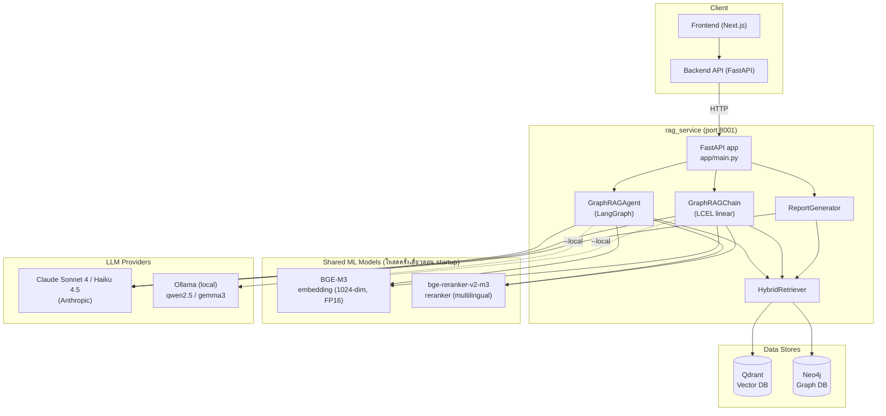
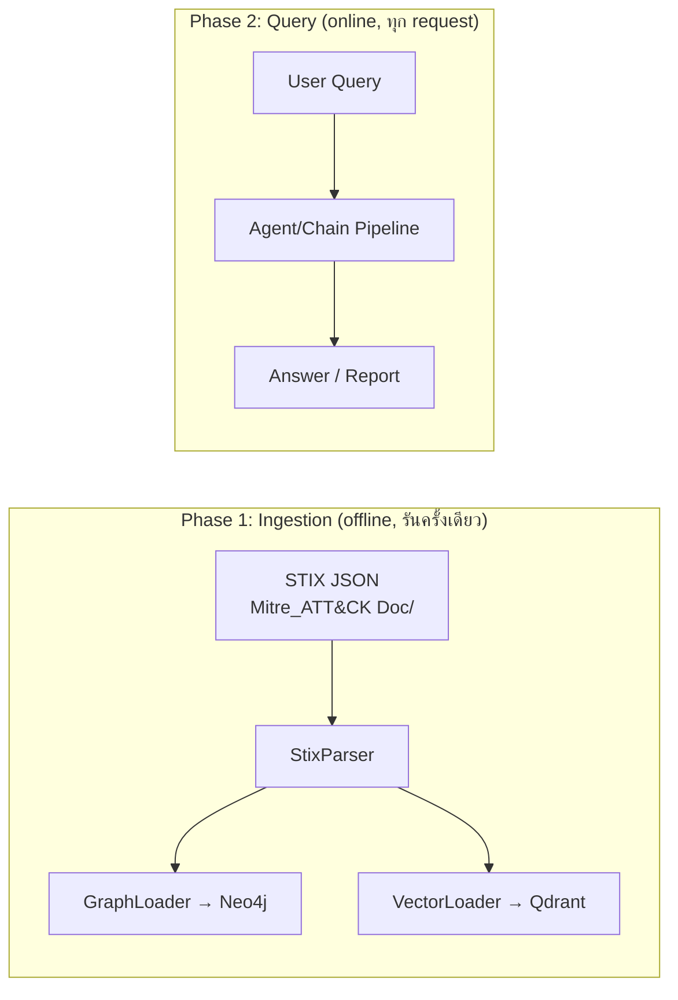
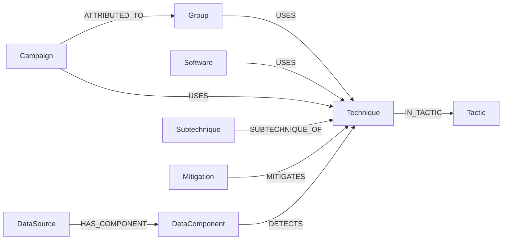
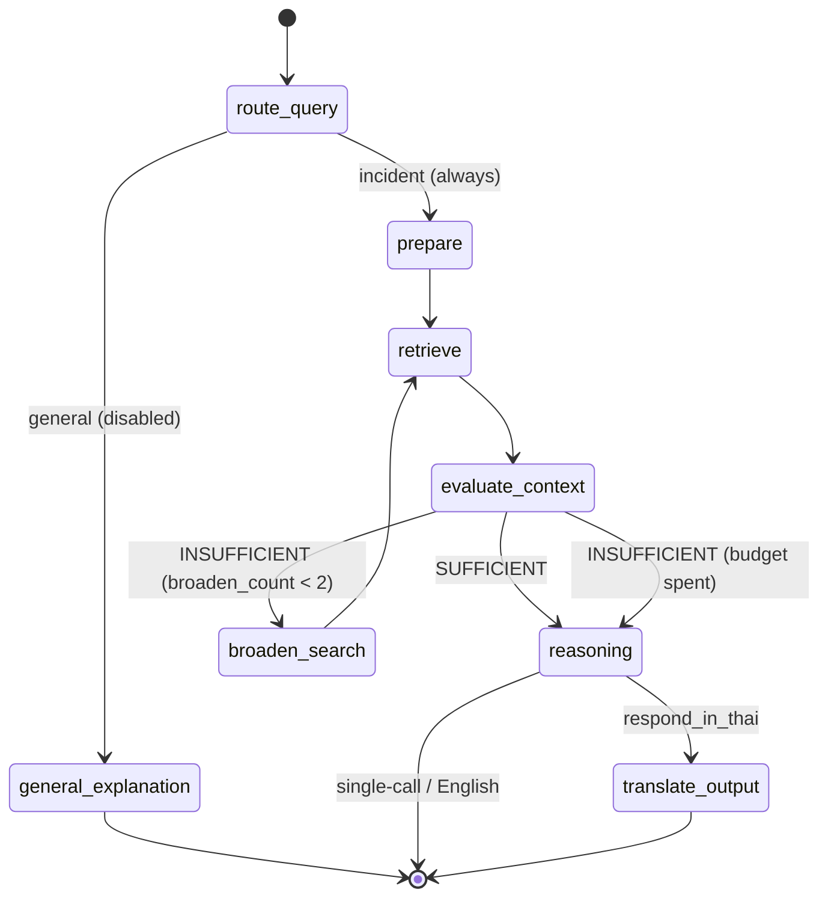
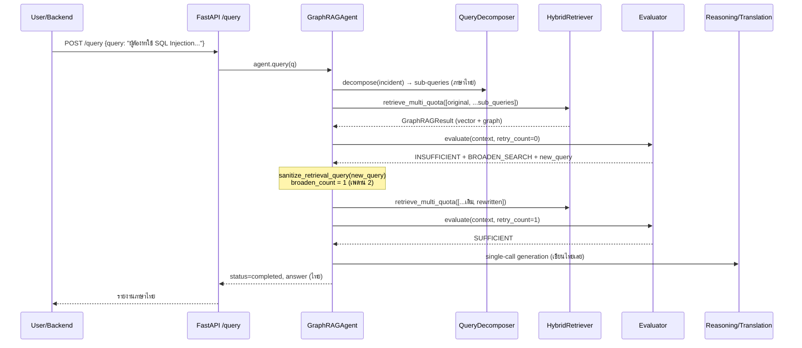

# RAG Module — Technical Documentation

> ⚠️ **ล้าสมัยบางส่วน — ตรวจเมื่อ 2026-08-15 (branch `chore/rag-service-cleanup`)**
> จุดที่ไม่ตรงกับโค้ดแล้ว: `use_local`/Ollama ถูกถอดออกจาก pipeline ที่ให้บริการ
> (เหลือใช้เฉพาะ `evaluation/`) · `GraphRAGChain` เป็น evaluation-only, `POST /query`
> เข้า `GraphRAGAgent` เสมอ · agent ไม่แปล query เป็นอังกฤษก่อน retrieve ·
> `--local` ไม่มีอยู่ใน RAG CLI (มีเฉพาะสคริปต์ eval) · ให้ยึด `CLAUDE.md` และตัวโค้ดเป็นหลัก

เอกสารฉบับนี้อธิบายโค้ดทั้งหมดของ **RAG Module** (`rag_service/`) ของโปรเจกต์ CyberCase Intelligence Framework
ครอบคลุม: System Architecture, Database Schema, Libraries, และคำอธิบาย **ทุกไฟล์/ทุกฟังก์ชัน** ว่าแต่ละส่วนทำอะไร

> อ้างอิงจากโค้ดจริง ณ ปัจจุบัน หากมีจุดที่โค้ดไม่ตรงกับเอกสารเดิม (`Architecture.md`, `pipeline.md`, `CLAUDE.md`) จะระบุไว้ในส่วน [§16 ข้อสังเกตจากโค้ดจริง](#16-ข้อสังเกตจากโค้ดจริง-codevsdocs)

---

## สารบัญ

1. [ภาพรวม (Overview)](#1-ภาพรวม-overview)
2. [System Architecture](#2-system-architecture)
3. [โครงสร้างไดเรกทอรี](#3-โครงสร้างไดเรกทอรี)
4. [Tech Stack & Libraries](#4-tech-stack--libraries)
5. [Configuration — `config.py`](#5-configuration--configpy)
6. [Data Models — `models.py`](#6-data-models--modelspy)
7. [Database Schema](#7-database-schema)
8. [Ingestion Layer — `ingestion/`](#8-ingestion-layer--ingestion)
9. [Retrieval Layer — `retrieval/`](#9-retrieval-layer--retrieval)
10. [Pipeline Layer — `pipeline/`](#10-pipeline-layer--pipeline)
11. [Service API — `app/main.py`](#11-service-api--appmainpy)
12. [CLI Entrypoint — `GraphRAG/main.py`](#12-cli-entrypoint--graphragmainpy)
13. [Package Exports — `__init__.py`](#13-package-exports--initpy)
14. [Evaluation Suite — `evaluation/`](#14-evaluation-suite--evaluation)
15. [End-to-End Flow (ตัวอย่างจริง)](#15-end-to-end-flow-ตัวอย่างจริง)
16. [ข้อสังเกตจากโค้ดจริง (Code vs Docs)](#16-ข้อสังเกตจากโค้ดจริง-codevsdocs)

---

## 1. ภาพรวม (Overview)

**RAG Module** คือ standalone microservice (`rag_service`) ที่ทำหน้าที่ "สมอง" ของระบบ — รับคำอธิบายเหตุการณ์โจมตีไซเบอร์ (ภาษาไทย/อังกฤษ) แล้วแปลงเป็นรายงานที่อ่านเข้าใจง่ายสำหรับอัยการ/พนักงานสอบสวน โดยอ้างอิงความรู้จาก **MITRE ATT&CK**

แนวคิดหลัก 3 อย่าง:

| แนวคิด | คืออะไร | ทำที่ไหน |
|--------|---------|----------|
| **Hybrid Retrieval** | ค้นหาด้วย Vector (ความหมาย) + Graph (ความสัมพันธ์) ควบคู่กัน | `retrieval/` |
| **Agentic Loop** | ประเมินบริบทเอง ถ้าไม่พอ → ถามผู้ใช้กลับ / ขยายการค้นหา | `pipeline/agent_graph.py` + `evaluator.py` |
| **Cross-Lingual** | แปลคำถามไทย→อังกฤษก่อนค้น แล้วแปลคำตอบกลับเป็นไทย | `pipeline/cross_lingual.py` |

Backend หลัก (FastAPI) **ไม่ได้ import โค้ด RAG โดยตรง** แต่เรียกผ่าน HTTP API มาที่ `rag_service` (port `8001`) — ดู [SKILL.md §3](../../SKILL.md)

---

## 2. System Architecture

### 2.1 องค์ประกอบระดับสูง



### 2.2 มี 2 เส้นทางการประมวลผล (Pipelines)

1. **`GraphRAGChain`** (`pipeline/chain.py`) — pipeline เชิงเส้น (LCEL) แบบดั้งเดิม: translate → retrieve → reason → translate กลับ ไม่มี loop
2. **`GraphRAGAgent`** (`pipeline/agent_graph.py`) — state machine (LangGraph) ที่มี self-reflection loop

API จะเลือกใช้ตัวไหนผ่าน flag `use_agent` (default `True` → ใช้ Agent)

### 2.3 Two-phase lifecycle



---

## 3. โครงสร้างไดเรกทอรี

```
rag_service/
├── Dockerfile                  # Build image: python:3.11-slim + ดาวน์โหลด BGE-M3 ล่วงหน้า
├── requirements.txt            # Dependencies ทั้งหมด
└── app/
    ├── main.py                 # ★ FastAPI service (entrypoint, port 8001)
    ├── download_model.py       # ดาวน์โหลด/แคช embedding model (ใช้ตอน build Docker)
    ├── _perf_probe.py          # เครื่องมือวัดเวลาแต่ละ node (throwaway)
    └── RAG/
        ├── __init__.py         # Re-export สิ่งที่ service ต้องใช้
        ├── Architecture.md     # (เอกสารเดิม) สถาปัตยกรรมระดับสูง
        ├── pipeline.md         # (เอกสารเดิม) รายละเอียด agentic pipeline
        └── GraphRAG/
            ├── __init__.py     # Public API ของแพ็กเกจ (export ทุก class หลัก)
            ├── config.py       # ★ ค่า config กลางทั้งหมด
            ├── models.py       # ★ Pydantic models ของ STIX entities
            ├── main.py         # ★ CLI (--ingest / --test / --agent / --local)
            ├── ingestion/      # อ่าน STIX → โหลดลง Neo4j + Qdrant
            │   ├── stix_parser.py
            │   ├── graph_loader.py
            │   └── vector_loader.py
            ├── retrieval/      # ค้นหา Vector + Graph
            │   ├── vector_retriever.py
            │   ├── graph_retriever.py
            │   ├── reranker.py
            │   └── hybrid_retriever.py
            ├── pipeline/       # Logic การประมวลผลคำถาม
            │   ├── router.py
            │   ├── cross_lingual.py
            │   ├── context_builder.py
            │   ├── evaluator.py
            │   ├── query_sanitizer.py
            │   ├── chain.py
            │   └── agent_graph.py
            └── evaluation/     # ชุดประเมินผล (RAGAS / metrics) — ไม่ใช่ runtime
                ├── eval_runner.py
                ├── generation_metrics.py
                ├── retriever_metrics.py
                ├── ground_truth.py
                ├── generate_eval_dataset.py
                └── *.json (datasets)
```

> สัญลักษณ์ ★ = ไฟล์ที่ควรอ่านก่อนเพื่อเข้าใจภาพรวม

---

## 4. Tech Stack & Libraries

จาก `requirements.txt` — กลุ่มหลักและหน้าที่:

| Library | เวอร์ชัน | ใช้ทำอะไรในโปรเจกต์ |
|---------|----------|---------------------|
| **fastapi** + **uvicorn** | ≥0.115 / ≥0.34 | Web framework + ASGI server ของ `rag_service` |
| **pydantic** / **pydantic-settings** | ≥2.13 | Validation ของ request/response และ STIX models |
| **neo4j** | ≥5.0 | Driver เชื่อม Graph DB |
| **qdrant-client** | ≥1.12 | Driver เชื่อม Vector DB (รองรับ hybrid search + RRF) |
| **FlagEmbedding** | ≥1.3 | โหลดและรัน **BGE-M3** (dense + sparse embeddings) |
| **sentence-transformers** | ≥5.4 | โหลด **Cross-Encoder reranker** |
| **anthropic** | ≥0.100 | SDK ของ Claude (ผ่าน langchain-anthropic) |
| **langchain** + **langchain-core** | ≥0.3 | LLM abstraction, message types, LCEL |
| **langchain-anthropic** | ≥1.4 | Binding `ChatAnthropic` |
| **langchain-ollama** | — | Binding `ChatOllama` สำหรับโหมด `--local` |
| **langgraph** | ≥0.4 | State machine ของ agentic pipeline |
| **torch** / **transformers** / **tokenizers** | ≥2.0 / ≥4.40 | Backend ของ embedding & reranker |
| **stix2** | ≥3.0 | (library STIX; การ parse จริงใช้ json ตรง ๆ) |
| **ragas** / **datasets** / **bert-score** / **rouge-score** | — | Evaluation suite (`evaluation/`) |
| **python-dotenv** | ≥1.0 | โหลด `.env` ใน `config.py` |
| **pypdf** | ≥5.0 | อ่าน PDF จาก reference documents หรือ knowledge assets ที่ใช้ใน flow อื่น |

**โมเดล ML 2 ตัวที่โหลดเข้าหน่วยความจำ:**
- **BGE-M3** (`BAAI/bge-m3`) — embedding 1024 มิติ, FP16, รองรับ dense + sparse ในตัวเดียว
- **bge-reranker-v2-m3** (`BAAI/bge-reranker-v2-m3`) — cross-encoder reranker (multilingual รวมภาษาไทย — จำเป็นสำหรับ dual-query; ดู [DUAL_QUERY_UPGRADE.md](DUAL_QUERY_UPGRADE.md))

ทั้งสองตัวถูกโหลด **ครั้งเดียวตอน startup** แล้ว share ให้ทุก component (ดู [§11](#11-service-api--appmainpy))

---

## 5. Configuration — `config.py`

ไฟล์ config กลาง รวมทุกค่าที่ปรับได้ของ pipeline โหลดค่าจาก environment variable / `.env` ด้วย `python-dotenv`

### Path resolution
```python
_SCRIPT_DIR = Path(__file__).resolve().parent          # .../GraphRAG/
_PROJECT_ROOT = _SCRIPT_DIR.parent.parent.parent        # .../rag_service/app/ ... → root
_STIX_DATA_DIR = _PROJECT_ROOT / "Mitre_ATT&CK Doc"
```
ใช้ `__file__` หา path แบบ dynamic (ห้าม hardcode — ดู [SKILL.md §3](../../SKILL.md))

### กลุ่มค่าหลัก

| กลุ่ม | ตัวแปร | ค่า | ความหมาย |
|-------|--------|-----|----------|
| **Embedding** | `EMBED_MODEL` | `BAAI/bge-m3` | โมเดล embedding |
| | `EMBED_DIM` | `1024` | ขนาด dense vector |
| | `USE_FP16` | `True` | ลด memory ครึ่งหนึ่ง (~2.3GB → ~1.2GB) |
| **Qdrant** | `QDRANT_URL` / `QDRANT_HOST` / `QDRANT_PORT` | env | ปลายทาง Vector DB (cloud / local / in-memory) |
| | `QDRANT_COLLECTION_ENTITIES` | `mitre_entities` | คอลเลกชัน entity |
| | `QDRANT_COLLECTION_RELATIONSHIPS` | `mitre_relationships` | คอลเลกชัน relationship |
| **RRF** | `RRF_K` / `DENSE_WEIGHT` / `SPARSE_WEIGHT` | `60` / `1.0` / `1.0` | พารามิเตอร์ fusion *(ดูหมายเหตุ §16)* |
| **Neo4j** | `NEO4J_URI` / `NEO4J_USER` / `NEO4J_PASSWORD` | env | ปลายทาง Graph DB |
| **LLM หลัก** | `LLM_MODEL` | `claude-sonnet-4-20250514` | reasoning + translation + routing |
| | `LLM_MAX_TOKENS` / `LLM_TEMPERATURE` | `4096` / `0` | |
| **LLM ประเมิน** | `EVALUATOR_LLM_MODEL` | `claude-haiku-4-5` | evaluator + query merger (เร็ว/ถูก) |
| | `EVALUATOR_MAX_TOKENS` | `1024` | ต้องพอสำหรับ verdict + reason + covered/missing phases + rewrite |
| **RAGAS** | `RAGAS_LLM_MODEL` | `qwen/qwen-2.5-72b-instruct` | LLM ประเมินใน evaluation suite |
| **Local (Ollama)** | `LOCAL_LLM_MODEL` | `qwen2.5:7b` | pipeline model เมื่อใช้ `--local` |
| | `LOCAL_EVAL_MODEL` | `gemma3:4b` | judge model (คนละ family → ลด bias) |
| **Retrieval** | `VECTOR_TOP_K` | `10` | จำนวนผลค้นเริ่มต้นต่อ query |
| | `GRAPH_EXPANSION_DEPTH` | `2` | จำนวน hop *(ดูหมายเหตุ §16)* |
| | `FINAL_TOP_K` | `5` | จำนวนผลหลัง rerank ที่ส่งเข้า context |
| | `RERANKER_MODEL` | `BAAI/bge-reranker-v2-m3` | multilingual รวมไทย (ตัวเดิม `mmarco-mMiniLMv2` comment ไว้ rollback) |
| **Cross-lingual** | `DUAL_QUERY_RETRIEVAL` | `true` (env) | query ไทยถูก retrieve ทั้งต้นฉบับ + คำแปลขนานกันแล้ว fuse — ปิดเพื่อกลับเป็น tRAG เดิม |
| **Domains** | `ATTACK_DOMAINS` | `{enterprise, mobile}` | โดเมน ATT&CK ที่ ingest |

### ฟังก์ชัน
- **`sep(title="")`** — พิมพ์เส้นคั่น (separator) ใน console สำหรับ verbose logging เช่น `── TITLE ──`

---

## 6. Data Models — `models.py`

Pydantic models ที่เป็น **typed representation ของ STIX 2.1 objects** ใช้เป็นโครงสร้างกลางระหว่าง parser → loader

### Base class
- **`AttackEntity`** — base ของ entity ทุกชนิด (= graph node) ฟิลด์: `stix_id`, `attack_id` (เช่น T1566), `name`, `description`, `node_label`, `url`, `domain`

### Subclasses (แต่ละชนิดเพิ่มฟิลด์เฉพาะ)

| Class | `node_label` | ฟิลด์เพิ่มเติม |
|-------|--------------|----------------|
| `Technique` | `Technique` | `platforms`, `is_subtechnique`, `tactics` (kill-chain phases) |
| `Group` | `Group` | `aliases` |
| `Software` | `Software` | `aliases`, `software_type` (`tool`/`malware`) |
| `Campaign` | `Campaign` | `aliases` |
| `Mitigation` | `Mitigation` | — |
| `Tactic` | `Tactic` | `shortname` (เช่น `initial-access`) |
| `DataSource` | `DataSource` | `platforms` |
| `DataComponent` | `DataComponent` | — |

### Relationship
- **`AttackRelationship`** — STIX relationship (= graph edge) ฟิลด์: `stix_id`, `relationship_type` (เช่น `uses`), `source_ref`/`target_ref` (STIX IDs), `source_name`/`target_name` (ใช้ตอน embed), `description`, `edge_label` (เช่น `USES`)

---

## 7. Database Schema

ระบบใช้ **2 ฐานข้อมูลคู่กัน** — แต่ละ entity ถูกเก็บทั้งใน Neo4j (โครงสร้างความสัมพันธ์) และ Qdrant (เวกเตอร์ความหมาย) โดยเชื่อมกันด้วย `stix_id`

### 7.1 Neo4j (Graph DB)

**Node labels** (จาก `models.py` + `graph_loader.create_constraints`):
`Technique`, `Subtechnique`, `Group`, `Software`, `Campaign`, `Mitigation`, `Tactic`, `DataSource`, `DataComponent`
+ ทุก node มี base label **`:Entity`** เพิ่มด้วย (ใช้ index กลางตอนสร้าง edge ให้เร็ว)

**Node properties:** `stix_id` (unique key), `attack_id`, `name`, `description` (≤5000 ตัวอักษร), `url`, `domain`
และฟิลด์เฉพาะ: `platforms`, `is_subtechnique`, `software_type`, `aliases`, `shortname`

**Relationship (edge) types:**

| Edge | ความหมาย | ที่มา |
|------|----------|-------|
| `USES` | Group/Software/Campaign ใช้ Technique | STIX `uses` |
| `MITIGATES` | Mitigation ลดทอน Technique | STIX `mitigates` |
| `SUBTECHNIQUE_OF` | Subtechnique เป็นลูกของ Technique | STIX `subtechnique-of` |
| `ATTRIBUTED_TO` | Campaign attribute ไปยัง Group | STIX `attributed-to` |
| `DETECTS` | DataComponent ตรวจจับ Technique | STIX `detects` |
| `IN_TACTIC` | Technique อยู่ใน Tactic | **derived** จาก `kill_chain_phases` |
| `HAS_COMPONENT` | DataSource มี DataComponent | **derived** จาก `x_mitre_data_source_ref` |

Edge property: `stix_id`, `description`

**Constraints & Indexes:**
- Unique constraint บน `stix_id` ของทุก label
- Index บน `attack_id` (Technique/Subtechnique), `name` (Group/Software), `shortname` (Tactic)



### 7.2 Qdrant (Vector DB)

**2 collections** (สร้างโดย `vector_loader._init_collection`):

| Collection | เก็บอะไร | จำนวน vector ต่อ point |
|------------|----------|------------------------|
| `mitre_entities` | embedding ของ entity ทุกตัว | dense (1024, COSINE) + sparse |
| `mitre_relationships` | embedding ของ relationship ทุกตัว | dense (1024, COSINE) + sparse |

**โครงสร้างแต่ละ point:**
- **id**: UUID ที่สร้างจาก `stix_id` (ดู `uuid_from_stix_id`)
- **vector**: `{"dense": [...1024], "sparse": SparseVector(indices, values)}`
- **payload (entities):** `stix_id`, `attack_id`, `entity_type="Node"`, `node_label`, `name`, `domain`, `url`, `document`
- **payload (relationships):** `stix_id`, `entity_type="Relationship"`, `edge_label`, `source_id`, `target_id`, `source_name`, `target_name`, `document`

**ข้อความที่ embed (`document`):**
- Entity: `"{node_label}: {name}. {description}"`
- Relationship: `"{source_name} {edge_label} {target_name}: {description}"`

> `entity_type` ใน payload สำคัญมาก — `hybrid_retriever` ใช้แยกว่าผลลัพธ์เป็น Node หรือ Relationship เพื่อดึง `stix_id` ไปขยาย graph ต่อ

---

## 8. Ingestion Layer — `ingestion/`

หน้าที่: อ่านไฟล์ STIX JSON → แปลงเป็น models → โหลดลงทั้ง 2 ฐานข้อมูล รันผ่าน `python main.py --ingest`

### 8.1 `stix_parser.py`

แปลง STIX 2.1 JSON bundles เป็น `AttackEntity` + `AttackRelationship`

**Helper functions (module-level):**
- **`_get_attack_id(obj)`** — ดึง ATT&CK ID (เช่น T1566) จาก `external_references`
- **`_get_url(obj)`** — ดึง URL จาก `external_references`
- **`_is_revoked_or_deprecated(obj)`** — เช็ก flag `revoked`/`x_mitre_deprecated` (ใช้กรองทิ้ง)
- **`_get_tactics_from_kill_chain(obj)`** — ดึงชื่อ tactic (shortname) จาก `kill_chain_phases`

**Mapping tables:**
- `RELATIONSHIP_TYPE_MAP` — แปลง STIX rel type → edge label (`uses`→`USES`, ฯลฯ)
- `STIX_TYPE_TO_LABEL` — แปลง STIX type → node label (`attack-pattern`→`Technique`, ฯลฯ)

**class `StixParser`:**
- **`__init__`** — เตรียม list `entities`/`relationships` และ lookup tables (`_id_to_name`, `_id_to_label`, `_tactic_shortname_to_id`, `_data_component_to_source`)
- **`parse_folder(folder, domain)`** — วน parse ทุกไฟล์ `.json` ในโฟลเดอร์
- **`parse_file(filepath, domain)`** — parse 1 bundle: **pass แรก** สร้าง entities (แยกตาม STIX type) + เก็บ raw relationships, **pass สอง** เรียก `_build_relationships`, แล้วสร้าง derived edges; จบด้วยพิมพ์สรุปจำนวน
- **`_parse_technique / _parse_group / _parse_software / _parse_campaign / _parse_mitigation / _parse_tactic / _parse_data_source / _parse_data_component`** — แปลง STIX object ดิบ → model ตามชนิด (technique แยก Subtechnique ด้วย `x_mitre_is_subtechnique`; software รวม `tool`+`malware`)
- **`_build_relationships(raw_rels)`** — สร้าง `AttackRelationship` จาก STIX relationship ดิบ; ข้ามที่ไม่รู้จัก/revoked และข้ามถ้าปลายทางไม่มีอยู่จริง
- **`_build_tactic_edges()`** — สร้าง edge `IN_TACTIC` (derived) จาก `tactics` ของแต่ละ Technique
- **`_build_data_source_edges()`** — สร้าง edge `HAS_COMPONENT` (derived) จาก data-source ref
- **`get_entities_by_label(label)` / `get_relationships_by_label(label)`** — filter helper

**Module function:**
- **`parse_all_domains()`** — parse ทุกโดเมนใน `ATTACK_DOMAINS`, **dedupe** ด้วย `stix_id` (เพราะหลายไฟล์ versioned ซ้ำกัน), คืน parser ที่พร้อมใช้

### 8.2 `graph_loader.py`

โหลด entities/relationships ลง **Neo4j**

**class `GraphLoader`:**
- **`__init__`** — เชื่อม Neo4j driver
- **`close()`** — ปิด driver
- **`clear_database()`** — ลบทุก node/edge (`MATCH (n) DETACH DELETE n`)
- **`create_constraints()`** — สร้าง unique constraint บน `stix_id` ของทุก label (รวม `:Entity`)
- **`create_indexes()`** — สร้าง index บนฟิลด์ที่ค้นบ่อย (`attack_id`, `name`, `shortname`)
- **`load_entities(entities)`** — dedupe → group ตาม label → `MERGE` node ทีละ batch (5000) พร้อมเพิ่ม `:Entity` label; คืนจำนวนที่โหลด
- **`_entity_to_props(entity)`** — แปลง model → dict properties (เพิ่มฟิลด์เฉพาะตามชนิด, truncate description ที่ 5000)
- **`load_relationships(relationships)`** — dedupe → group ตาม edge label → `CREATE` edge ทีละ batch โดย MATCH ปลายทางผ่าน `:Entity` (เร็วเพราะ deduped + clear แล้ว)
- **`load_all(parser)`** — orchestrate ครบ flow: clear → constraints → indexes → nodes → edges → พิมพ์สถิติสุดท้าย

### 8.3 `vector_loader.py`

Embed แล้วโหลดลง **Qdrant**

**Module function:**
- **`uuid_from_stix_id(stix_id)`** — แปลง STIX ID เป็น UUID ที่ valid (ลองดึงส่วนหลัง `--` ถ้าเป็น UUID อยู่แล้ว ไม่งั้น hash ด้วย MD5) — จำเป็นเพราะ Qdrant point id ต้องเป็น UUID/int

**class `VectorLoader`:**
- **`__init__`** — เชื่อม Qdrant (cloud/local/in-memory) + รับ embedding model (ถ้าไม่ส่งมาจะโหลด BGE-M3 เอง)
- **`_embed_texts(texts)`** — encode batch คืน `{dense, sparse}` (เรียก BGE-M3 `return_dense=True, return_sparse=True`)
- **`_init_collection(name)`** — ลบ collection เดิม (ถ้ามี) แล้วสร้างใหม่ พร้อม config dense (1024, COSINE) + sparse
- **`load_entities(entities)`** — สร้าง document `"{label}: {name}. {desc}"`, embed ทีละ batch (16), upsert เป็น `PointStruct` พร้อม payload; ข้าม entity ที่ไม่มี description
- **`load_relationships(relationships)`** — เหมือนข้างบนแต่ document = `"{src} {edge} {tgt}: {desc}"`
- **`load_all(parser)`** — embed ทั้ง entity + relationship

---

## 9. Retrieval Layer — `retrieval/`

หัวใจของ Hybrid GraphRAG: ค้น vector → rerank → ขยาย graph → รวมผล

### 9.1 `vector_retriever.py`

ค้นหาความหมายใน Qdrant ด้วย **hybrid search (dense + sparse) + RRF fusion** ที่ Qdrant ทำให้ในตัว

**dataclass `VectorResult`** — ผลค้น 1 รายการ: `document`, `metadata` (= payload), `score`, `stix_id`

**class `VectorRetriever`:**
- **`__init__`** — เชื่อม Qdrant + รับ/โหลด embedding model + พิมพ์จำนวน doc ในแต่ละ collection
- **`_search_hybrid(collection, query, top_k, filter)`** — แกนหลัก:
  1. embed query เป็น dense + sparse
  2. ยิง `query_points` ด้วย `Prefetch` 2 ทาง (dense, sparse) แล้ว fuse ด้วย `FusionQuery(Fusion.RRF)`
  3. parse ผลเป็น `VectorResult`
- **`search_entities(query, top_k, node_label_filter)`** — ค้นใน `mitre_entities` (filter ตาม node_label ได้)
- **`search_relationships(query, top_k, edge_label_filter)`** — ค้นใน `mitre_relationships`
- **`_normalize_scores(results)`** *(staticmethod)* — min-max normalize score ให้อยู่ [0,1] เพื่อเทียบข้าม collection ได้
- **`search_all(query, top_k)`** — ค้นทั้ง 2 collection (entity เต็ม top_k, relationship ครึ่งหนึ่ง) → normalize → รวม → เรียงตาม score → ตัด top_k *(เอนเอียงไปทาง Technique/Tactic node)*

### 9.2 `graph_retriever.py`

ขยาย subgraph จาก Neo4j ตาม STIX IDs ที่ได้จาก vector search

**dataclasses:**
- **`GraphNode`** — node: `stix_id`, `name`, `label`, `attack_id`, `description`
- **`GraphEdge`** — edge: `edge_label`, `source_name`, `target_name`, `description`
- **`SubgraphResult`** — center node + neighbors + edges
  - **`to_text()`** — format subgraph เป็นข้อความอ่านง่ายสำหรับ LLM (จัดกลุ่ม edge ตามชนิด แปลงเป็นคำอ่านง่าย เช่น `USES`→"Used by")

**class `GraphRetriever`:**
- **`__init__` / `close()`** — จัดการ Neo4j driver
- **`expand(stix_ids)`** — วนเรียก `_expand_single` ต่อแต่ละ id (dedupe), คืน list ของ subgraph
- **`_expand_single(stix_id)`** — ดึง center node + relationship **ขาออก** + **ขาเข้า** (1 hop) มาเป็น `SubgraphResult`
- **`query_cypher(cypher, params)`** — รัน Cypher ดิบ คืน list[dict]
- **`get_multi_hop_path(start_name, end_name, max_hops=4)`** — หา shortest path ระหว่าง 2 entity (เช่น "Lazarus Group เกี่ยวกับ WannaCry ยังไง")

### 9.3 `reranker.py`

จัดอันดับผลใหม่ด้วย cross-encoder ให้แม่นกว่า score จาก vector อย่างเดียว

**class `Reranker`:**
- **`__init__(model_name)`** — โหลด `CrossEncoder` (max_length 512)
- **`rerank(query, results, top_k)`** — ให้คะแนน (query, document) ทุกคู่ → ผ่าน **sigmoid** ให้อยู่ [0,1] → เขียนทับ `result.score` → เรียงมากไปน้อย คืนผลที่ rerank แล้ว

### 9.4 `hybrid_retriever.py`

**Orchestrator** ที่รวม vector + rerank + graph เข้าด้วยกัน (เป็นตัวที่ pipeline เรียกใช้จริง)

**dataclass `GraphRAGResult`** — ผลรวม: `vector_results` + `graph_results`
- **`get_context_text(max_length)`** — format ผลรวมเป็นข้อความ (มี `context_builder` เวอร์ชันละเอียดกว่าใช้แทนใน pipeline)

**class `HybridRetriever`:**
- **`__init__`** — สร้าง `VectorRetriever`, `GraphRetriever`, `Reranker` (share embedding/reranker จากภายนอกได้)
- **`close()`** — ปิด graph driver
- **`retrieve(query, top_k, node_label_filter)`** — flow 1 query:
  1. **Vector search** (`search_all`)
  2. **Rerank** (`reranker.rerank`)
  3. **ดึง STIX IDs** ตามลำดับความเกี่ยวข้อง (Node → ใช้ `stix_id` ตรง ๆ; Relationship → ใช้ `source_id`+`target_id`) จนได้ครบ `FINAL_TOP_K`
  4. **Graph expansion** (`graph_retriever.expand`)
  5. คืน `GraphRAGResult`
- **`retrieve_multi(queries, top_k, ...)`** — รัน `retrieve()` หลาย query (คำแปลอังกฤษ + ไทยต้นฉบับ [dual-query] + rewrites) แล้ว **merge + dedupe**:
  - vector: key ด้วย `stix_id` เก็บตัว score สูงสุด
  - graph: key ด้วย center `stix_id` เก็บตัวแรก
  - เรียง vector ใหม่ตาม score → คืน `GraphRAGResult` เดียว *(ปัจจุบันเป็นทางเข้าหลักของทุกโหมด — agent, chain)*

---

## 10. Pipeline Layer — `pipeline/`

ส่วน logic การประมวลผลคำถามทั้งหมด

### 10.1 `router.py`

จัดประเภทคำถามก่อนเข้า pipeline

- **`ROUTER_SYSTEM_PROMPT`** — prompt สั่งให้ LLM ทำหน้าที่ "routing เท่านั้น" คืน label เดียว
- **class `QueryRouter`:**
  - **`__init__(use_local)`** — สร้าง LLM (Claude/Ollama/None)
  - **`route_query(query)`** — คืน `GENERAL_EXPLANATION` (ถามนิยาม/แนวคิด → ตอบตรง ไม่ retrieve) หรือ `INCIDENT_ANALYSIS` (อธิบายเหตุการณ์ → เข้า RAG); ถ้าไม่มี LLM → default `INCIDENT_ANALYSIS`

> หมายเหตุ: ใน `agent_graph` router **ถูกปิดชั่วคราว** — บังคับเข้า incident เสมอ (ดู §16)

### 10.2 `cross_lingual.py`

จัดการภาษา ไทย ↔ อังกฤษ ตลอด pipeline

**Prompts (module-level):**
- **`TRANSLATE_TO_ENGLISH_PROMPT`** — แปลคำถามไทย→อังกฤษ โดยคงศัพท์เทคนิค/ATT&CK ID
- **`REASONING_SYSTEM_PROMPT`** — system prompt ของ Reasoning LLM: เขียนใหม่ให้เข้าใจง่าย (อังกฤษเท่านั้น), simplify jargon, คงลำดับเหตุการณ์/ID, ห้ามแต่งเติม, output 4 หัวข้อตายตัว (INCIDENT SUMMARY / ATTACK SEQUENCE / MITRE ATT&CK TECHNIQUES IDENTIFIED / IMPACT ASSESSMENT)
- **`TRANSLATE_TO_THAI_SYSTEM_PROMPT`** — system prompt ของ Translation LLM: แปลอังกฤษ→ไทย คงศัพท์เทคนิค/ID เป็นอังกฤษ แปลชื่อหัวข้อทั้ง 4

**Helper functions:**
- **`_is_thai(text)`** — มีอักขระไทยไหม (regex `฀-๿`)
- **`_is_mostly_english(text)`** — สัดส่วนตัวอักษรอังกฤษ > 70% ไหม
- **`build_retrieval_queries(original_query, english_query, extra_queries)`** — สร้าง query list สำหรับ **dual-query retrieval**: คำแปลอังกฤษมาก่อนเสมอ (evaluator/rewrites key จากตัวนี้) → เพิ่มไทยต้นฉบับเป็น query ที่สองเมื่อ `DUAL_QUERY_RETRIEVAL` เปิด + query เป็นไทย + ไม่ซ้ำคำแปล → ต่อท้าย rewrites (dedup) — เป็น**จุดเดียว**ที่กำหนดนโยบาย cross-lingual retrieval ทุก path ใช้ร่วมกัน (ดู [DUAL_QUERY_UPGRADE.md](DUAL_QUERY_UPGRADE.md))

**class `CrossLingualLayer`:**
- **`__init__(use_local)`** — สร้าง LLM สำหรับแปล (max_tokens 256)
- **`translate_query(query)`** — แปลไทย→อังกฤษ (ข้ามถ้าเป็นอังกฤษอยู่แล้ว/ไม่มี LLM)
- **`get_reasoning_system_prompt()`** *(static)* — คืน `REASONING_SYSTEM_PROMPT`
- **`get_translation_system_prompt()`** *(static)* — คืน `TRANSLATE_TO_THAI_SYSTEM_PROMPT`
- **`should_respond_in_thai(query)`** *(static)* — ตัดสินว่าคำตอบสุดท้ายควรเป็นไทยไหม (= คำถามเป็นไทย)

### 10.3 `context_builder.py`

ประกอบ context จากผล retrieval เป็น prompt

- **`build_context(result, max_context_length=10000)`** — format `GraphRAGResult` เป็นข้อความ: ส่วน "Semantic Search Results" (top `FINAL_TOP_K` พร้อม score) + ส่วน "Graph Context" (3 subgraph แรก), truncate ถ้ายาวเกิน
- **`build_generation_prompt(context, original_query, english_query, respond_in_thai)`** — สร้าง user prompt สุดท้ายส่ง LLM:
  - ต่อด้วย context + คำถาม + คำสั่ง (ไทย/อังกฤษ)

### 10.4 `evaluator.py`

"ผู้พิพากษา" ประเมินว่า context เพียงพอไหม — หัวใจของ self-reflection

**Constants:** `VERDICT_SUFFICIENT`, `VERDICT_INSUFFICIENT`, `MAX_RETRIES=2`

**dataclass `EvaluationResult`** — `verdict`, `reason`, `covered_phases`, `missing_phases`, `strategy`, `new_query`, `gap_warning`, `message`

**`EVALUATOR_SYSTEM_PROMPT`** — prompt ที่ให้ LLM:
- **answerability gate**: ถ้า query ไม่มีพฤติกรรมผู้โจมตีที่เป็นรูปธรรมเลย → INSUFFICIENT + `ACKNOWLEDGE_LIMIT` (ถามผู้ใช้เพิ่มไม่ได้แล้ว)
- ตัดสินจาก **semantic coverage** (ไม่ใช่ keyword) เอนเอียงไป SUFFICIENT
- เช็ก attack phases 4 ขั้น (Initial Access / Credential Access / Privilege Escalation / Impact)
- INSUFFICIENT → **ต้อง** เลือก fallback strategy 1 ใน 3: `BROADEN_SEARCH` (พร้อม `new_query` เป็นประโยคเดียว ไม่มี markdown/ATT&CK ID) / `PARTIAL_ANSWER` / `ACKNOWLEDGE_LIMIT`
- output เป็น JSON

**class `ContextEvaluator`:**
- **`__init__(use_local)`** — สร้าง evaluator LLM (Haiku/gemma3)
- **`evaluate(original_query, english_query, context, retry_count, verbose)`** — ตัวหลัก:
  - ถ้า `retry_count >= MAX_RETRIES` → บังคับ SUFFICIENT (กัน loop) โดยไม่เรียก LLM
  - ถ้าไม่มี LLM → SUFFICIENT
  - ไม่งั้น: เติม retry hint ใน system prompt → เรียก LLM → parse
- **`_build_prompt(...)`** *(static)* — สร้าง user prompt: retry hint, query, context (truncate 4000)
- **`_parse_response(raw)`** *(static)* — แกะ JSON จากคำตอบ LLM 3 ชั้น (regex → brace scan → fallback SUFFICIENT) เพื่อความทนทาน

### 10.5 `query_sanitizer.py`

ทำความสะอาด query ที่ LLM เขียนก่อนเข้า embedding (ใช้กับ `new_query` ของ BROADEN_SEARCH)

- **`sanitize_retrieval_query(text)`** — ตัด markdown (`*_\`#>`), ATT&CK ID token (`T1110`, `TA0006`, …), วงเล็บว่าง แล้วยุบ whitespace เป็นบรรทัดเดียว
- เหตุผล: rewrite ถูก embed ตรงๆ — bold marker กับ ID token ทำให้ไปแมตช์ metadata แทน technique description

### 10.6 `chain.py` — `GraphRAGChain` (linear LCEL)

Pipeline เชิงเส้นแบบดั้งเดิม ไม่มี loop

- **`_print_sources(result, top_n)`** — พิมพ์ source สำหรับ debug
- **class `GraphRAGChain`:**
  - **`__init__(embed_model, reranker, use_local)`** — สร้าง translator, retriever, router, reasoning LLM, translation LLM
  - **`close()`** — ปิด retriever
  - **`query(user_query, verbose)`** — flow ครบ:
    1. route (ถ้า GENERAL → ตอบตรง)
    2. แปลคำถาม→อังกฤษ
    3. hybrid `retrieve_multi` กับ `build_retrieval_queries` (dual-query: คำแปล + ไทยต้นฉบับ)
    4. `build_context`
    5. Reasoning LLM → narrative อังกฤษ
    6. ถ้าคำถามไทย → Translation LLM → ไทย
  - **`retrieve_only(user_query)`** — รันแค่ retrieval (dual-query เช่นกัน) คืน context (debug)

### 10.7 `agent_graph.py` — `GraphRAGAgent` (LangGraph) ★

Pipeline แบบ agentic — state machine ที่ loop ได้ มี self-reflection (ตัวที่ API ใช้ default)

> **หมายเหตุ (2026-07-28):** follow-up module (pause → ถามผู้ใช้ → `resume`) ถูกถอดออกแล้ว — ย้ายไปเป็นหน้าที่ของ Backend ดู `docs/FOLLOWUP_REMOVAL.md`

**`AgentState` (TypedDict)** — state ที่ไหลผ่านทุก node: query, route, translation, retrieval, evaluation, `broaden_count`, `rewritten_queries`, fallback strategy, answer

**dataclass `AgentResponse`** — response ที่คืนออกไป: `status` (= `completed` เสมอ), `answer`, `context`, `graphrag_result`
- **`to_dict()`** — helper serialize เป็น dict

**Constants:** `MAX_BROADEN_RETRIES=2`

**class `GraphRAGAgent`:**

*Setup:*
- **`__init__(embed_model, reranker, use_local)`** — สร้างทุก component (retriever, router, evaluator, decomposer) + LLM + เรียก `_build_graph` (stateless — ไม่มี session store)

*Public API:*
- **`close()`** — ปิด retriever
- **`retrieve_only(user_query)`** — decompose + quota retrieve คืน context (debug)
- **`query(user_query, verbose)`** — รัน graph จนถึง END แล้วคืน `status="completed"` (ไม่มีการ pause)
- **`query_fast(...)` / `query_ultrafast(...)`** — เส้นทาง latency ต่ำ (ตัด decompose/eval/graph ออกตามลำดับ)

*Internal helpers:*
- **`_build_graph()`** — ประกอบ LangGraph: register nodes + edges + conditional edges → compile

*Nodes (แต่ละ step ใน graph):*
- **`_node_route_query`** — จัดประเภทคำถาม
- **`_node_general_explanation`** — ตอบความรู้ทั่วไป (ไม่ retrieve)
- **`_node_translate_query`** — ตรวจภาษา + แปล→อังกฤษ
- **`_node_retrieve`** — multi-query hybrid retrieval: สร้าง query list ด้วย `build_retrieval_queries` (คำแปลอังกฤษ + ไทยต้นฉบับ [dual-query] + rewrites) → `retrieve_multi` + build context
- **`_node_evaluate_context`** — เรียก evaluator (ส่ง `retry_count=broaden_count`)
- **`_node_broaden_search`** — sanitize + เพิ่ม rewritten query จาก strategy BROADEN_SEARCH แล้ว loop กลับ retrieve
- **`_node_reasoning`** — Reasoning LLM สร้างคำตอบ (มี fast-path สำหรับ ACKNOWLEDGE_LIMIT เมื่อ verdict = INSUFFICIENT)
- **`_node_translate_output`** — Translation LLM แปลเป็นไทย

*Edge routers (ตัดสินทางเดิน):*
- **`_edge_after_route`** — ปัจจุบันบังคับ `"incident"` เสมอ (router ปิดชั่วคราว)
- **`_edge_after_evaluation`** — SUFFICIENT→reasoning / INSUFFICIENT + ยังมีโควตา + มี `new_query` ใช้ได้→broaden / นอกนั้น→reasoning
- **`_edge_after_reasoning`** — ถ้าต้องตอบไทย **และยังไม่ `answer_is_final`**→translate ไม่งั้น→done



### 10.8 `report_generator.py` (Moved to Backend in Phase 2A)

ถูกย้ายไปที่ `backend/app/services/reporting/generator.py::ReportGenerator` เพื่อแยกความรับผิดชอบ (RAG ทำแค่ค้นหาข้อมูล Backend เป็นผู้ orchestrate และสร้างรายงาน)

---

## 11. Service API — `app/main.py`

FastAPI service จุดเข้าออกของ RAG (port `8001`)

**Lifecycle:**
- **`lifespan(app)`** — ตอน startup: โหลด **BGE-M3** + **Reranker** ครั้งเดียว แล้ว share ให้ `GraphRAGChain`, `GraphRAGAgent`, `HybridRetriever`, `ReportGenerator` (เก็บใน `app.state`); ตอน shutdown: ปิดทุก component
  > ออกแบบให้โหลดโมเดลหนักครั้งเดียว ไม่ใช่ทุก request

**Request/Response models:**
- **`QueryRequest`** — `query`, `use_agent` (default `True`)
- **`QueryResponse`** — `status` (= `"completed"` เสมอ), `answer`, `retrieval_context_id`, `mitre_table`
- **`RetrievalContextSnapshot`** — snapshot ของ context ที่ cache ไว้

**Endpoints:**

| Method | Path | ฟังก์ชัน | หน้าที่ |
|--------|------|----------|---------|
| GET | `/health` | `health` | เช็กว่า chain/agent โหลดสำเร็จไหม |
| POST | `/query` | `query_rag` | ค้นถาม — `use_agent=True`→Agent, `False`→Chain |
| GET | `/retrieval-contexts/{id}` | `get_retrieval_context` | ดึง snapshot ของ retrieval context ที่ cache ไว้ |

> `POST /resume` ถูกลบแล้ว (2026-07-28) — follow-up เป็นหน้าที่ของ Backend
> Path เหล่านี้คือของ `rag_service` เอง ส่วน report endpoints อยู่ฝั่ง Backend แล้วและไม่ได้ proxy มาที่ RAG Service

**ไฟล์ประกอบอื่น:**
- **`download_model.py`** — สคริปต์ดาวน์โหลด/แคช BGE-M3 ล่วงหน้า (รันตอน build Docker เพื่อไม่ต้องโหลดตอน runtime)
- **`_perf_probe.py`** — เครื่องมือวัดเวลาแต่ละ node (throwaway)

---

## 12. CLI Entrypoint — `GraphRAG/main.py`

CLI สำหรับ ingest/test/debug รันในโฟลเดอร์ `GraphRAG/`

**UTF-8 fix:** reconfigure `stdout`/`stderr` เป็น UTF-8 (จำเป็นบน Windows console)

**ฟังก์ชันหลัก:**
- **`run_ingest()`** — parse STIX → โหลด Neo4j (`GraphLoader`) → โหลด Qdrant (`VectorLoader`)
- **`run_tests(retrieve_only, use_agent, use_local)`** — รัน `TEST_QUERIES` (29 เคสภาษาไทย) ผ่าน pipeline
- **`run_interactive(...)`** — โหมดถามตอบสด
- **`main()`** — parse args แล้ว dispatch

**Flags:**

| Flag | ทำอะไร |
|------|--------|
| `--ingest` | parse STIX → Neo4j + Qdrant |
| `--test` | รัน test queries |
| `--retrieve-only` | retrieval อย่างเดียว ไม่เรียก LLM (debug) |
| `--agent` | ใช้ `GraphRAGAgent` (LangGraph) แทน chain |
| `--local` | ใช้ Ollama (`qwen2.5:7b` + `gemma3:4b`) แทน Claude API |

---

## 13. Package Exports — `__init__.py`

- **`RAG/__init__.py`** — re-export ของที่ `app/main.py` ต้องใช้: `AgentResponse`, `CyberCaseReport`, `GraphRAGAgent`, `GraphRAGChain`, `HybridRetriever`, `ReportGenerator`, `build_context`
- **`RAG/GraphRAG/__init__.py`** — public API เต็มของแพ็กเกจ (export ทุก model, retriever, pipeline component, `__version__ = "2.0.0"`)

---

## 14. Evaluation Suite — `evaluation/`

ชุดเครื่องมือ **benchmark คุณภาพ RAG** (ไม่ใช่โค้ด runtime — แยกจาก service โดยสมบูรณ์) ประเมิน 2 มิติ: คุณภาพ **retrieval** และคุณภาพ **generation** โดยใช้ "graph เป็น ground truth"

รันผ่าน:
```bash
cd rag_service/app/RAG/GraphRAG
python -m evaluation.eval_runner --dataset evaluation/Thai_dataset.json --mode full
```

### 14.1 `ground_truth.py` — โครงสร้างชุดข้อมูลประเมิน

- **dataclass `EvalSample`** — 1 ตัวอย่าง: `query`, `relevant_stix_ids` (เฉลยที่ควร retrieve ได้), `reference_answer` (คำตอบทอง — optional), `language`, `category`
  - **`has_reference_answer()`** — มี reference answer ไหม
- **`load_ground_truth(path)`** — โหลด dataset จาก JSON เป็น `list[EvalSample]`
- **`save_ground_truth(samples, path)`** — บันทึก dataset เป็น JSON

### 14.2 `retriever_metrics.py` — เมตริกการค้นคืน

**ฟังก์ชันเมตริก (pure functions):**
| ฟังก์ชัน | วัดอะไร |
|----------|---------|
| **`hit_at_k`** | top-K มี doc ที่เกี่ยวข้องอย่างน้อย 1 ตัวไหม (0/1) |
| **`recall_at_k`** | สัดส่วน doc ที่เกี่ยวข้องที่เจอใน top-K |
| **`precision_at_k`** | สัดส่วน top-K ที่เกี่ยวข้องจริง |
| **`reciprocal_rank`** | 1/อันดับของผลที่เกี่ยวข้องตัวแรก (→ MRR) |
| **`ndcg_at_k`** | Normalized Discounted Cumulative Gain (คิดน้ำหนักตามอันดับ) |
| **`average_precision`** | ค่าเฉลี่ย precision ที่ทุกตำแหน่งที่ relevant (→ MAP) |

- **dataclass `RetrieverEvalResult`** — เก็บผลรวม (hit/recall/precision/ndcg ต่อ K, mrr, map, latency) + **`to_table()`** จัดตาราง
- **`evaluate_retriever(retriever_fn, samples, k_values, name)`** — รัน `retriever_fn` (รับ query คืน list STIX IDs) ทุก sample, จับเวลา, คำนวณเมตริกทั้งหมดเฉลี่ย, คืน `RetrieverEvalResult`

### 14.3 `generation_metrics.py` — เมตริกคุณภาพคำตอบ

**Fallback metrics (ไม่ต้องพึ่ง dependency หนัก):**
- **`_tokenize(text)`** — tokenizer ง่าย ๆ (lowercase + split)
- **`token_f1(prediction, reference)`** — precision/recall/F1 ระดับ token
- **`rouge_l(prediction, reference)`** — ROUGE-L (longest common subsequence ผ่าน DP)

**Heavy metrics (optional dependency):**
- **`_try_ragas_evaluate(questions, answers, contexts, refs, use_local)`** — เรียก **RAGAS** วัด `faithfulness` (+`answer_correctness` ถ้ามี reference); เลือก judge LLM ตามลำดับ Claude Haiku → OpenRouter; ข้ามถ้าโหมด local + ไม่มี cloud key
- **`_try_bertscore(predictions, references)`** — **BERTScore** F1 (semantic similarity); คืน None ถ้าไม่ได้ติดตั้ง

- **dataclass `GenerationEvalResult`** — RAGAS scores + fallback (token_f1/rouge_l/bertscore) + latency + **`to_table()`**
- **`evaluate_generation(query_fn, samples, use_local)`** — รัน `query_fn` (รับ query คืน `(answer, context_chunks)`) ทุก sample → คำนวณ fallback metrics → ลอง RAGAS/BERTScore → คืนผลรวม

### 14.4 `generate_eval_dataset.py` — สร้าง dataset แบบ Neo4j-grounded

แนวคิด: **"graph คือ ground truth"** — ทุก `relevant_stix_ids` มาจาก Cypher query กับ Neo4j โดยตรง จึงไม่มี labeling error

- **dataclass `GeneratedSample`** — sample ที่ generate ได้ (+`to_dict()`)
- **class `Neo4jGroundTruthBuilder`** — เชื่อม Neo4j + ดึง seed nodes:
  - **`run_query`**, **`get_top_techniques`**, **`get_top_groups`**, **`get_top_software`**, **`get_all_tactics`**, **`get_groups_with_campaigns`**, **`get_techniques_with_detection`**, **`get_techniques_by_attack_ids`** — แต่ละตัวคือ Cypher หา node ที่เชื่อมโยงดี/ตรงเงื่อนไข
- **class `QueryTemplateRegistry`** — 10 template สร้างคู่ (คำถาม + เฉลย + reference answer) จาก traversal pattern:
  `generate_mitigation_lookup`, `generate_technique_lookup`, `generate_group_software`, `generate_group_techniques`, `generate_tactic_techniques`, `generate_software_techniques`, `generate_technique_detection`, `generate_technique_groups`, `generate_software_type_query`, `generate_campaign_attribution`
- **`THAI_QUERY_TEMPLATES` / `THAI_ANSWER_PREFIX` / `_make_thai_variant`** — สร้างเวอร์ชันภาษาไทยจาก sample อังกฤษ (deterministic ไม่ใช้ LLM)
- **`INCIDENT_SCENARIOS`** + **class `IncidentScenarioGenerator`** — สถานการณ์โจมตีเชิงเล่าเรื่อง (ไทย+อังกฤษ) ที่ผูก ATT&CK ID → STIX ID ผ่าน Neo4j (เช่น phishing→credential theft→exfiltration, ransomware, supply chain, ICS)
- **class `DatasetGenerator`** — orchestrator: วน template × seed nodes + incident scenarios → ผสมสัดส่วนไทย (`thai_ratio`) → คืน sample ทั้งหมด (dedup query)
- **class `DatasetValidator`** + **`ValidationResult`** — ตรวจ dataset: ห้าม ground truth ว่าง, ห้าม query ซ้ำ, ขั้นต่ำจำนวน sample/หมวด, สรุปสถิติ
- **`save_dataset` / `load_dataset_for_validation`** — I/O
- **`main()`** — CLI: generate (default) หรือ `--validate-only`

### 14.5 `eval_runner.py` — ตัวรันประเมิน (orchestrator)

- **Retriever adapters** — wrap retriever แต่ละแบบให้เป็นฟังก์ชัน `query → list[stix_id]`:
  - **`_make_vector_retriever_fn`** — vector อย่างเดียว
  - **`_make_graph_retriever_fn`** — graph อย่างเดียว (แยก ATT&CK ID/keyword จาก query → Cypher → ขยาย 1 hop)
  - **`_make_hybrid_retriever_fn`** — hybrid (vector + graph)
- **`_make_generation_fn`** — wrap `GraphRAGChain` ให้คืน `(answer, context_chunks)` สำหรับ RAGAS
- **class `EvalRunner`** — โหลด dataset (กรอง sample ที่มี relevant ids > 50 ทิ้ง), share embedding model, รันตาม mode:
  - **`_run_retriever_eval`** — benchmark ทั้ง 3 retriever แล้วพิมพ์ตารางเทียบ (`_print_comparison`)
  - **`_run_generation_eval`** — ประเมินคุณภาพคำตอบ
- **`main()`** — CLI: `--dataset`, `--mode {retriever|generation|full}`, `--output`, `--max-samples`, `--local`

### 14.6 `test_metrics.py` — unit tests

ทดสอบฟังก์ชันเมตริกด้วย input/output ที่รู้ผลแน่นอน (ไม่ต้องใช้ DB/model) — ครอบคลุม hit@k, recall@k, precision@k, MRR, NDCG, MAP, token_f1, rouge_l, และ ground-truth I/O รันด้วย `python evaluation/test_metrics.py`

### 14.7 Datasets (`*.json`)

ไฟล์ชุดข้อมูลสำเร็จ: `Thai_dataset.json`, `Thai_dataset_08.json`, `eval_dataset*.json` — โครงสร้างตาม `EvalSample` (query / relevant_stix_ids / reference_answer / language / category)

### 14.8 `crosslingual_benchmark.py` — เทียบกลยุทธ์ cross-lingual retrieval

Benchmark เฉพาะทางสำหรับคำถามภาษาไทย เทียบ 3 คอนฟิกบน dataset เดียวกัน:

| Config | Query ที่ retrieve | แทนอะไร |
|--------|--------------------|---------|
| `tRAG` | คำแปลอังกฤษอย่างเดียว | พฤติกรรมเดิม (translate-then-retrieve) |
| `Thai-direct` | ไทยต้นฉบับอย่างเดียว | ขีดความสามารถ cross-lingual ของ BGE-M3 ล้วน |
| `Dual-query` | ทั้งสอง fuse กัน | พฤติกรรมปัจจุบัน (`DUAL_QUERY_RETRIEVAL`) |

- ใช้ `evaluate_retriever` + เมตริกชุดเดียวกับ `eval_runner` (Hit/Recall/NDCG@K, MRR, MAP)
- คำแปลถูก cache ใน `evaluation/translation_cache.json` — ทุกคอนฟิกเห็นคำแปลเดียวกัน รันซ้ำฟรี
- Default วัด vector + rerank (ส่วนที่ภาษามีผล); `--with-graph` วัด pipeline เต็ม
- รัน: `python -m evaluation.crosslingual_benchmark --max-samples 50` — รายละเอียดดู [DUAL_QUERY_UPGRADE.md §5](DUAL_QUERY_UPGRADE.md)

---

## 15. End-to-End Flow (ตัวอย่างจริง)

**กรณี: ผู้ใช้ถามภาษาไทย ผ่านโหมด Agent และ context รอบแรกไม่พอ (self-reflection loop)**



**สรุปลำดับ node:** `route_query → prepare → retrieve → evaluate_context → [broaden_search → retrieve → evaluate_context]* → reasoning → (translate_output) → END`
— ไม่มีการ pause: ทุกการเรียกจบด้วย `status="completed"`

---

## 16. ข้อสังเกตจากโค้ดจริง (Code vs Docs)

จุดที่โค้ดปัจจุบัน **ไม่ตรง** กับเอกสารเดิม / config — ควรรู้ไว้เวลาแก้หรือเขียนรายงาน:

| # | ประเด็น | เอกสาร/config ว่า | โค้ดจริงทำ |
|---|---------|-------------------|------------|
| 1 | **Router ใน Agent** | route ไป general/incident ตาม intent | `_edge_after_route` **บังคับ `incident` เสมอ** (โค้ด general ถูก comment ไว้) — `route_query` ยังถูกเรียกแต่ผลไม่ถูกใช้ |
| 2 | **Graph expansion depth** | `GRAPH_EXPANSION_DEPTH = 2` (2 hops) | `_expand_single` ดึงแค่ **1 hop** (ขาเข้า+ขาออก); ค่า config นี้ไม่ถูกอ่านใน `graph_retriever.py` |
| 3 | **RRF params** | `RRF_K=60`, `DENSE_WEIGHT`, `SPARSE_WEIGHT` | ใช้ `FusionQuery(Fusion.RRF)` ของ Qdrant ซึ่ง **ไม่รับค่าพวกนี้** — เป็น config ที่ยังไม่ถูกใช้จริง |
| 4 | **RAGAS LLM** | CLAUDE.md/Architecture.md: `llama-3.3-70b` | `config.py` จริง: `qwen/qwen-2.5-72b-instruct` |
| 5 | **Verdict ของ evaluator** | บางที่พูดถึง `NEED_CLARIFICATION` | คงเหลือ 2 ค่า: `SUFFICIENT` / `INSUFFICIENT` (`NEED_CLARIFICATION` ถูกลบทิ้งแล้วพร้อม follow-up module) |
| 6 | **CHROMA / E5** | — | config ยังมีโค้ด ChromaDB + E5 (legacy) ไว้ rollback แต่ไม่ถูกใช้ (ใช้ Qdrant + BGE-M3) |
| 7 | **API paths** | CLAUDE.md: `/api/v1/rag/query` | `rag_service` จริงเปิด `/query`, `/health`, `/retrieval-contexts/{id}` (prefix `/api/v1` เป็นของ Backend) |

---

*เอกสารนี้ครอบคลุมเฉพาะ **RAG Module** (`rag_service/`) ตามขอบเขตที่กำหนด — ไม่รวม Frontend/Backend หลัก หากต้องการเอกสารส่วนอื่นแยกเพิ่มได้*
